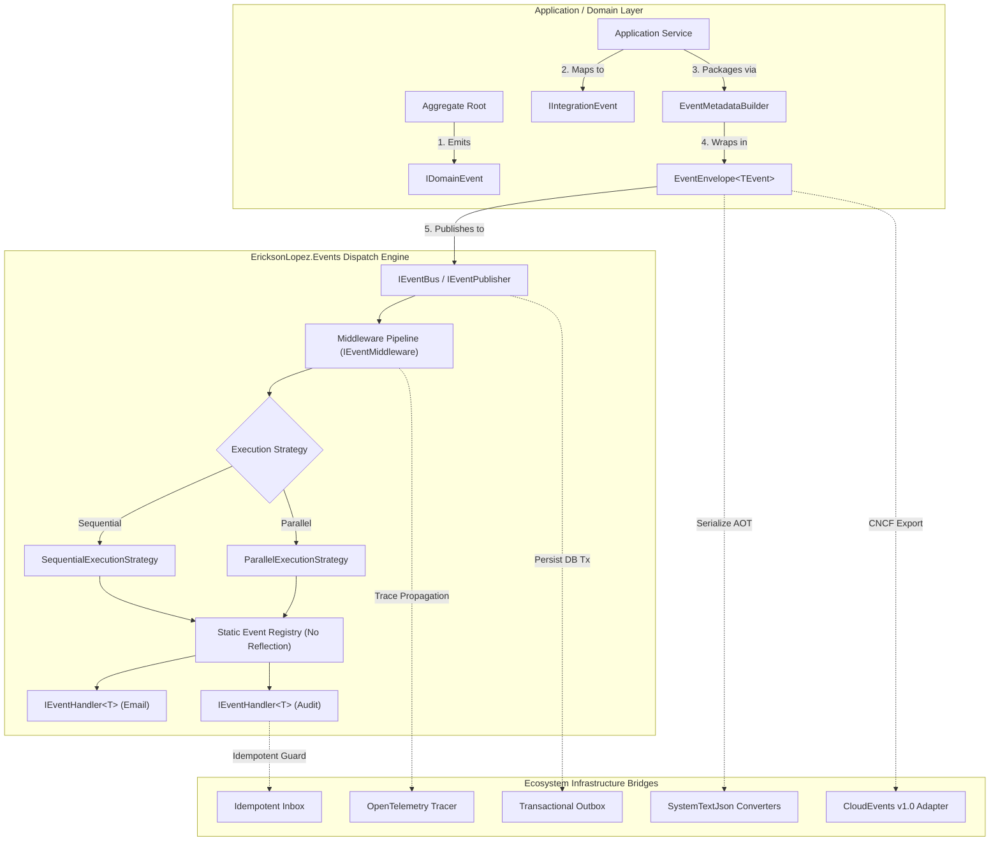
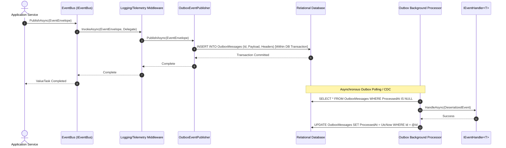

# EricksonLopez.Events

High-performance, zero-allocation, enterprise-grade Event-Driven Architecture and Distributed Messaging Foundation for modern .NET.

[](https://github.com/ericksonlopezf/dotnet-events/actions)
[](https://codecov.io/gh/ericksonlopezf/dotnet-events)
[](https://sonarcloud.io/summary/new_code?id=ericksonlopezf_dotnet-events)
[](https://github.com/ericksonlopezf/dotnet-events/blob/main/docs/mutation-score.md)
[](https://www.nuget.org/packages/EricksonLopez.Events)
[](https://www.nuget.org/packages/EricksonLopez.Events)
[](https://github.com/ericksonlopezf/dotnet-events/blob/main/LICENSE)
[](https://dotnet.microsoft.com)
[](https://learn.microsoft.com/en-us/dotnet/core/deploying/native-aot)

---

**EricksonLopez.Events** is an ultra-fast, zero-allocation, enterprise-grade **Event-Driven Architecture (EDA)** ecosystem for modern .NET (`.NET 8`, `.NET 9`, `.NET 10`). Engineered for mission-critical microservices and high-throughput modular monoliths, it provides zero-allocation in-process event dispatching, transactional Outbox and Idempotent Inbox abstractions, CNCF CloudEvents v1.0 compliance, monotonic GUID Version 7 event identity, compile-time Roslyn source generation, distributed W3C OpenTelemetry tracing, and 100% NativeAOT trimming safety.

---

## Table of Contents

- [What Problem It Solves](#-what-problem-it-solves)
- [Key Features](#-key-features)
- [Ecosystem](#-ecosystem)
- [Documentation](#-documentation)
  - [Interactive Showcase (Levels 00 to 08)](#-step-by-step-interactive-showcase-levels-00-to-08)
  - [Technical Reference & Architecture Guides](#-technical-reference--architecture-guides)
- [Installation](#-installation)
- [Quick Start](#-quick-start)
  - [1. Defining Domain Events](#1-defining-domain-events)
  - [2. Packaging with EventMetadata & Envelope](#2-packaging-with-eventmetadata--envelope)
  - [3. Implementing Asynchronous Event Handlers](#3-implementing-asynchronous-event-handlers)
  - [4. Configuring Dependency Injection & In-Process Dispatching](#4-configuring-dependency-injection--in-process-dispatching)
  - [5. CNCF CloudEvents v1.0 Conversion](#5-cncf-cloudevents-v10-conversion)
- [Core Use Cases](#-core-use-cases)
  - [Use Case 1: Clean Architecture Domain Event Publishing](#use-case-1-clean-architecture-domain-event-publishing)
  - [Use Case 2: Transactional Outbox with Atomic Database Persistence](#use-case-2-transactional-outbox-with-atomic-database-persistence)
  - [Use Case 3: Exactly-Once Idempotent Inbound Processing with Inbox](#use-case-3-exactly-once-idempotent-inbound-processing-with-inbox)
  - [Use Case 4: CNCF CloudEvents v1.0 Cross-Service Event Mesh](#use-case-4-cncf-cloudevents-v10-cross-service-event-mesh)
  - [Use Case 5: Compile-Time Zero-Reflection Event Registries with Source Generators](#use-case-5-compile-time-zero-reflection-event-registries-with-source-generators)
  - [Use Case 6: Distributed OpenTelemetry Context Propagation](#use-case-6-distributed-opentelemetry-context-propagation)
- [Configuration & Integrations](#-configuration--integrations)
  - [Dependency Injection & Execution Modes](#dependency-injection--execution-modes)
  - [Pipeline Middlewares (IEventMiddleware)](#pipeline-middlewares-ieventmiddleware)
  - [OpenTelemetry Tracing & Metrics](#opentelemetry-tracing--metrics)
  - [System.Text.Json NativeAOT Serialization](#systemtextjson-nativeaot-serialization)
  - [Roslyn Compile-Time Diagnostic Analyzers](#roslyn-compile-time-diagnostic-analyzers)
- [Testing & Quality](#-testing--quality)
  - [Declarative Assertions with FakeEventPublisher](#declarative-assertions-with-fakeeventpublisher)
  - [TestEventHandler and Synthetic Event Builders](#testeventhandler-and-synthetic-event-builders)
  - [Mutation Testing Verification (Stryker.NET)](#mutation-testing-verification-strykernet)
- [Performance Benchmarks](#-performance-benchmarks)
  - [Event Dispatching & Identifier Benchmarks](#event-dispatching--identifier-benchmarks)
  - [Memory Allocation Profile](#memory-allocation-profile)
- [Compatibility & Technical Matrix](#-compatibility--technical-matrix)
  - [Target Framework Support & AOT Compliance](#target-framework-support--aot-compliance)
  - [Domain Event to CloudEvents Mapping Matrix](#domain-event-to-cloudevents-mapping-matrix)
- [Architecture & Design Principles](#-architecture--design-principles)
  - [Functional Dispatch Pipeline](#functional-dispatch-pipeline)
  - [Event Lifecycle & Transactional Outbox Flow](#event-lifecycle--transactional-outbox-flow)
- [Best Practices & Anti-Patterns](#-best-practices--anti-patterns)
- [Troubleshooting & Common Pitfalls](#-troubleshooting--common-pitfalls)
- [Part of the EricksonLopez Ecosystem](#-part-of-the-ericksonlopez-ecosystem)
- [Contributing](#-contributing)
- [License](#-license)

---

## 🎯 What Problem It Solves

In modern distributed .NET architectures, microservices, and Domain-Driven Design (DDD), traditional mediator implementations and heavy message-bus frameworks introduce severe operational and architectural liabilities:

1. **Heavy Heap Allocations and GC Latency Spikes:**
   Standard mediator and messaging libraries box event payloads, allocate intermediate delegate arrays, instantiate heap wrappers (`Task<Unit>`), and construct transient dictionary objects for headers, causing Garbage Collector thrashing and latency jitter in high-throughput hot paths.
2. **Pervasive Runtime Reflection & NativeAOT Incompatibility:**
   Legacy event buses scan loaded assemblies at startup using `Assembly.GetTypes()` and invoke handlers dynamically via `MethodInfo.Invoke` or runtime generic specialization (`MakeGenericType`). This breaks trimming, inflates container startup times, and causes fatal crashes in ahead-of-time compiled (NativeAOT) environments.
3. **Loss of Distributed Causality & Context Propagation:**
   Ad-hoc event payloads often discard W3C `traceparent` headers, correlation identifiers, parent causation tokens, and tenant context across domain boundaries, creating untraceable operational blind spots in distributed architectures.
4. **Dual-Write Inconsistencies & Message Duplication:**
   Publishing directly to message brokers inside database transactions without formal Transactional Outbox and Idempotent Inbox abstractions leads to lost updates, split-brain data corruption, and duplicate downstream processing during network partitions.

### How `EricksonLopez.Events` Solves This

- **Zero-Allocation In-Process Pipeline:** Employs `ValueTask`-based dispatching, stack-allocated span formatting (`ISpanFormattable`, `IUtf8SpanFormattable`), and `FrozenDictionary`-backed headers to achieve **0 bytes of heap allocation** in core publishing paths.
- **100% NativeAOT & Trimming Compliance:** Roslyn incremental source generators inspect code at compile time, eliminating runtime reflection and emitting static handler registries.
- **Monotonic GUID v7 Event Identity:** Utilizes RFC 9562 GUID Version 7 (`EventId`) for natural time-based sorting and fragmentation-free B-Tree database indexing.
- **Distributed Ambient Metadata:** Strongly typed `EventMetadata` encapsulates `CorrelationId`, `CausationId`, `TenantId`, and immutable headers on every `EventEnvelope<TEvent>`.
- **Open Standards & Reliability Patterns:** Built-in bidirectional CNCF CloudEvents v1.0 mapping, pure Transactional Outbox contracts, and consumer deduplication Inbox filters.

---

## ⚡ Key Features

- 🚀 **Zero-Allocation In-Process Dispatching**: Nanosecond-level handler execution using `ValueTask` return types without intermediate heap allocations.
- 🆔 **Monotonic Guid v7 Identity (`EventId`)**: RFC 9562-compliant time-ordered identifiers supporting zero-allocation formatting via `ISpanFormattable` and `IUtf8SpanFormattable`.
- 📦 **Strongly Typed `EventEnvelope<TEvent>`**: Clean reference envelope bundling immutable event payloads with contextual ambient metadata.
- 🌐 **CNCF CloudEvents v1.0 Standard**: Bi-directional transformation between internal envelopes and the CloudEvents JSON schema.
- 🔒 **Transactional Outbox & Inbox Abstractions**: Pure contracts enabling guaranteed at-least-once publishing and idempotent inbound consumption.
- ⚡ **Roslyn Incremental Source Generators**: Automatic compile-time event and handler discovery generating reflection-free static registries.
- 🛡️ **Roslyn Compile-Time Analyzers (`ELE001`–`ELE005`)**: Enforces immutability, valid attribute configurations, and domain-to-integration architectural boundaries.
- 📊 **First-Class OpenTelemetry Observability**: Native BCL `ActivitySource` distributed tracing context propagation and `System.Diagnostics.Metrics` counters.
- 🧪 **Enterprise Test Doubles**: In-memory `FakeEventPublisher`, spy `TestEventHandler<T>`, and fluent assertion DSL for test automation.

---

## 📦 Ecosystem

The `EricksonLopez.Events` ecosystem is divided into modular, fine-grained, single-responsibility packages:

| Package | Version | Description |
|---|---|---|
| [`EricksonLopez.Events`](https://www.nuget.org/packages/EricksonLopez.Events) | [](https://www.nuget.org/packages/EricksonLopez.Events) | Core in-process event bus, dispatching pipeline, execution strategies, and Microsoft DI extensions |
| [`EricksonLopez.Events.Contracts`](https://www.nuget.org/packages/EricksonLopez.Events.Contracts) | [](https://www.nuget.org/packages/EricksonLopez.Events.Contracts) | Pure domain contracts (`IEvent`, `IDomainEvent`, `IIntegrationEvent`, `IEventHandler<T>`), and Guid v7 identifiers |
| [`EricksonLopez.Events.CloudEvents`](https://www.nuget.org/packages/EricksonLopez.Events.CloudEvents) | [](https://www.nuget.org/packages/EricksonLopez.Events.CloudEvents) | Bidirectional CNCF CloudEvents v1.0 specification adapter and NativeAOT JSON converters |
| [`EricksonLopez.Events.Generators`](https://www.nuget.org/packages/EricksonLopez.Events.Generators) | [](https://www.nuget.org/packages/EricksonLopez.Events.Generators) | Roslyn incremental source generator for static event registries and compile-time code analyzers |
| [`EricksonLopez.Events.Inbox`](https://www.nuget.org/packages/EricksonLopez.Events.Inbox) | [](https://www.nuget.org/packages/EricksonLopez.Events.Inbox) | Idempotent event consumer decorator and message deduplication abstractions |
| [`EricksonLopez.Events.OpenTelemetry`](https://www.nuget.org/packages/EricksonLopez.Events.OpenTelemetry) | [](https://www.nuget.org/packages/EricksonLopez.Events.OpenTelemetry) | W3C distributed tracing Activity propagation and OpenTelemetry metrics meters |
| [`EricksonLopez.Events.Outbox`](https://www.nuget.org/packages/EricksonLopez.Events.Outbox) | [](https://www.nuget.org/packages/EricksonLopez.Events.Outbox) | Transactional Outbox persistence contracts and envelope packaging |
| [`EricksonLopez.Events.Serialization.SystemTextJson`](https://www.nuget.org/packages/EricksonLopez.Events.Serialization.SystemTextJson) | [](https://www.nuget.org/packages/EricksonLopez.Events.Serialization.SystemTextJson) | High-performance NativeAOT System.Text.Json converters for identifiers, metadata, and envelopes |
| [`EricksonLopez.Events.Testing`](https://www.nuget.org/packages/EricksonLopez.Events.Testing) | [](https://www.nuget.org/packages/EricksonLopez.Events.Testing) | Test doubles (`FakeEventPublisher`), spy handlers, and fluent assertions for unit and integration testing |

---

## 📚 Documentation

> 🌐 **Official Documentation Hub:** [https://github.com/ericksonlopezf/dotnet-events/tree/main/docs](https://github.com/ericksonlopezf/dotnet-events/tree/main/docs)

### 🎓 Step-by-Step Interactive Showcase (Levels 00 to 08)

| Level | Topic | Description |
|---|---|---|
| [**Level 00**](https://github.com/ericksonlopezf/dotnet-events/blob/main/docs/showcase/level-00-introduction.md) | **Architecture & Philosophy** | Core architectural foundations, domain boundaries, and zero-allocation guarantees |
| [**Level 01**](https://github.com/ericksonlopezf/dotnet-events/blob/main/docs/showcase/level-01-getting-started.md) | **Getting Started & Primitives** | Defining immutable domain and integration events with monotonic `EventId` (Guid v7) |
| [**Level 02**](https://github.com/ericksonlopezf/dotnet-events/blob/main/docs/showcase/level-02-envelopes-and-metadata.md) | **Envelopes & Metadata** | Composing ambient context with `EventMetadataBuilder` and wrapping events |
| [**Level 03**](https://github.com/ericksonlopezf/dotnet-events/blob/main/docs/showcase/level-03-dispatching-and-handlers.md) | **In-Process Dispatching** | Implementing `IEventHandler<T>` and executing sequential or parallel pipelines |
| [**Level 04**](https://github.com/ericksonlopezf/dotnet-events/blob/main/docs/showcase/level-04-cloudevents-interop.md) | **CloudEvents Integration** | Bidirectional CNCF CloudEvents v1.0 standard mapping and serialization |
| [**Level 05**](https://github.com/ericksonlopezf/dotnet-events/blob/main/docs/showcase/level-05-outbox-and-inbox.md) | **Transactional Outbox & Inbox** | At-least-once persistence guarantees and idempotent consumer deduplication |
| [**Level 06**](https://github.com/ericksonlopezf/dotnet-events/blob/main/docs/showcase/level-06-source-generators-and-aot.md) | **Source Generation & NativeAOT** | Compile-time event registry generation and zero-reflection pipelines |
| [**Level 07**](https://github.com/ericksonlopezf/dotnet-events/blob/main/docs/showcase/level-07-opentelemetry-tracing.md) | **OpenTelemetry & Tracing** | Distributed W3C Activity context propagation and BCL metrics instrumentation |
| [**Level 08**](https://github.com/ericksonlopezf/dotnet-events/blob/main/docs/showcase/level-08-fluent-testing.md) | **Enterprise Testing** | Test doubles (`FakeEventPublisher`), test spies, and fluent assertion DSL |

### 📖 Technical Reference & Architecture Guides

- [**Architecture & Invariants**](https://github.com/ericksonlopezf/dotnet-events/blob/main/docs/architecture.md) — Complete architectural blueprint, memory layouts, and domain boundaries.
- [**Architectural Decision Records (ADRs)**](https://github.com/ericksonlopezf/dotnet-events/tree/main/docs/adr) — Comprehensive catalog of 30+ ADRs documenting design rationale and rejected proposals.
- [**API Reference Guide**](https://github.com/ericksonlopezf/dotnet-events/blob/main/docs/api-reference.md) — Microsoft Learn-style exhaustive specification of all public types, methods, and interfaces.
- [**Cookbook & Enterprise Recipes**](https://github.com/ericksonlopezf/dotnet-events/blob/main/docs/cookbook.md) — Production-ready recipes for DDD, Outbox, CloudEvents, NativeAOT, and unit testing.
- [**Technical Audit & Verification**](https://github.com/ericksonlopezf/dotnet-events/blob/main/docs/audit.md) — Complete technical audit, security model, and invariant verification.
- [**Competitive Audit**](https://github.com/ericksonlopezf/dotnet-events/blob/main/docs/competitive-audit.md) — In-depth architectural comparison vs MediatR, MassTransit, Wolverine, and Brighter.
- [**Features & Compatibility Matrix**](https://github.com/ericksonlopezf/dotnet-events/blob/main/docs/features-matrix.md) — Target framework matrix, diagnostics rules, and runtime guarantees.
- [**Best Practices Guide**](https://github.com/ericksonlopezf/dotnet-events/blob/main/docs/best-practices.md) — Recommended production patterns for microservices and Clean Architecture.
- [**Anti-Patterns & Pitfalls**](https://github.com/ericksonlopezf/dotnet-events/blob/main/docs/anti-patterns.md) — Prohibited design patterns, memory leak traps, and concurrency bugs.
- [**Diagnostics & Troubleshooting Guide**](https://github.com/ericksonlopezf/dotnet-events/blob/main/docs/troubleshooting.md) — Analysis and resolutions for runtime exceptions and Roslyn analyzer errors.
- [**Mutation Testing Score Report**](https://github.com/ericksonlopezf/dotnet-events/blob/main/docs/mutation-score.md) — Stryker.NET mutation audit reports achieving 100% mutation score across packages.
- [**Allocation & Memory Analysis**](https://github.com/ericksonlopezf/dotnet-events/blob/main/docs/analysis/allocations.md) — Zero-allocation mechanics, struct layouts, and JIT devirtualization.
- [**Migration Guide**](https://github.com/ericksonlopezf/dotnet-events/blob/main/docs/migration-guide.md) — Step-by-step instructions for migrating from MediatR notifications or raw event buses.
- [**Package Dependency Reference**](https://github.com/ericksonlopezf/dotnet-events/blob/main/docs/package-reference.md) — Inter-package dependency topology and architectural layering rules.
- [**CI/CD Pipeline & Supply Chain Security**](https://github.com/ericksonlopezf/dotnet-events/blob/main/docs/cicd.md) — GitHub Actions workflows, automated releases, and SLSA compliance.

---

## 📥 Installation

Install the required packages using the .NET CLI or NuGet Package Manager:

### 1. Core Package (Required for In-Process Dispatching)

```bash
dotnet add package EricksonLopez.Events
```

### 2. Pure Domain Contracts (For Domain & Application Layers)

```bash
dotnet add package EricksonLopez.Events.Contracts
```

### 3. Optional Framework & Integration Packages

```bash
# CNCF CloudEvents v1.0 standard adapter
dotnet add package EricksonLopez.Events.CloudEvents

# Roslyn Source Generator for static reflection-free registries & analyzers
dotnet add package EricksonLopez.Events.Generators

# Transactional Outbox & Idempotent Inbox abstractions
dotnet add package EricksonLopez.Events.Outbox
dotnet add package EricksonLopez.Events.Inbox

# Native OpenTelemetry distributed tracing & metrics
dotnet add package EricksonLopez.Events.OpenTelemetry

# System.Text.Json NativeAOT converters
dotnet add package EricksonLopez.Events.Serialization.SystemTextJson
```

### 4. Testing & Assertion Packages (For Test Projects)

```bash
dotnet add package EricksonLopez.Events.Testing
```

---

## 🚀 Quick Start

### 1. Defining Domain Events

Domain events represent immutable business facts that occurred within the domain model. Use `sealed record` types with `EventId` (monotonic GUID Version 7):

```csharp
using EricksonLopez.Events.Contracts;
using EricksonLopez.Events.Identifiers;

public sealed record OrderPlacedDomainEvent(
    EventId Id,
    Guid OrderId,
    Guid CustomerId,
    decimal TotalAmount,
    string Currency,
    DateTimeOffset OccurredAt) : IDomainEvent;
```

### 2. Packaging with `EventMetadata` & Envelope

Wrap events into an `EventEnvelope<TEvent>` and enrich them with distributed correlation tokens:

```csharp
using EricksonLopez.Events.Attributes;
using EricksonLopez.Events.Contracts;
using EricksonLopez.Events.Envelopes;
using EricksonLopez.Events.Identifiers;
using EricksonLopez.Events.Metadata;

[EventName("orders.order-placed")]
[EventVersion(1)]
[EventSource("ordering-service")]
public sealed record OrderPlacedIntegrationEvent(
    EventId Id,
    Guid OrderId,
    decimal TotalAmount,
    DateTimeOffset OccurredAt) : IIntegrationEvent;

// Build contextual metadata and package into envelope
var metadata = new EventMetadataBuilder()
    .WithCorrelationId(CorrelationId.New())
    .WithCausationId(CausationId.From("CMD-CREATE-ORDER-881"))
    .WithTenantId(TenantId.From("tenant-us-east"))
    .WithSource("ordering-service")
    .WithHeader("X-Client-Version", "1.4.0")
    .Build();

var domainEvent = new OrderPlacedIntegrationEvent(
    EventId.New(),
    Guid.NewGuid(),
    199.99m,
    DateTimeOffset.UtcNow);

var envelope = EventEnvelope.Create(domainEvent, metadata);
```

### 3. Implementing Asynchronous Event Handlers

Implement `IEventHandler<TEvent>` returning a lightweight `ValueTask` for zero-allocation asynchronous execution:

```csharp
using System.Threading;
using System.Threading.Tasks;
using EricksonLopez.Events.Contracts;

public sealed class SendOrderConfirmationHandler : IEventHandler<OrderPlacedIntegrationEvent>
{
    public ValueTask HandleAsync(OrderPlacedIntegrationEvent eventInstance, CancellationToken cancellationToken = default)
    {
        // Execute side effect (e.g. notify notification service)
        Console.WriteLine($"[Notification] Order confirmation sent for order: {eventInstance.OrderId}");
        return ValueTask.CompletedTask;
    }
}
```

### 4. Configuring Dependency Injection & In-Process Dispatching

Register the event bus and subscribers using Microsoft Dependency Injection:

```csharp
using EricksonLopez.Events.Bus.Configuration;
using EricksonLopez.Events.Bus.Extensions;
using EricksonLopez.Events.Contracts;
using Microsoft.Extensions.DependencyInjection;

var services = new ServiceCollection();

services.AddEventBus(options =>
{
    options.ExecutionMode = EventExecutionMode.Sequential;
    options.ErrorPolicy = ErrorHandlingPolicy.FailFast;
    options.MaxReentrancyDepth = 10;
});

// Register event handlers
services.AddEventHandler<OrderPlacedIntegrationEvent, SendOrderConfirmationHandler>();

using var serviceProvider = services.BuildServiceProvider();
using var scope = serviceProvider.CreateScope();

var eventBus = scope.ServiceProvider.GetRequiredService<IEventBus>();
await eventBus.PublishAsync(domainEvent, CancellationToken.None);
```

### 5. CNCF CloudEvents v1.0 Conversion

Transform internal envelopes to and from standard CloudEvents v1.0 for cross-boundary messaging:

```csharp
using EricksonLopez.Events.CloudEvents;

// Export internal envelope to CNCF CloudEvent v1.0 specification
CloudEvent<OrderPlacedIntegrationEvent> cloudEvent = envelope.ToCloudEvent(
    defaultSource: new Uri("https://orders.eshop.com"),
    schemaBaseUri: new Uri("https://schemas.eshop.com"));

// Import CloudEvent back to native EventEnvelope<T>
EventEnvelope<OrderPlacedIntegrationEvent> restoredEnvelope = cloudEvent.ToEventEnvelope();
```

---

## 💡 Core Use Cases

### Use Case 1: Clean Architecture Domain Event Publishing

In Clean Architecture, domain entities raise domain events internally without dependencies on dispatch infrastructure. Application services harvest and dispatch them through `IEventPublisher`:

```csharp
using EricksonLopez.Events.Contracts;
using EricksonLopez.Events.Identifiers;

public sealed class OrderAggregate
{
    private readonly List<IDomainEvent> _domainEvents = new();
    public Guid Id { get; }
    public decimal Total { get; }
    public IReadOnlyCollection<IDomainEvent> DomainEvents => _domainEvents.AsReadOnly();

    public OrderAggregate(Guid id, decimal total)
    {
        Id = id;
        Total = total;
        _domainEvents.Add(new OrderPlacedDomainEvent(EventId.New(), id, Guid.NewGuid(), total, "USD", DateTimeOffset.UtcNow));
    }

    public void ClearDomainEvents() => _domainEvents.Clear();
}

public sealed class PlaceOrderCommandHandler
{
    private readonly IEventPublisher _publisher;

    public PlaceOrderCommandHandler(IEventPublisher publisher) => _publisher = publisher;

    public async Task HandleAsync(OrderAggregate order, CancellationToken ct)
    {
        // Persist aggregate state...
        foreach (var domainEvent in order.DomainEvents)
        {
            await _publisher.PublishAsync(domainEvent, ct);
        }
        order.ClearDomainEvents();
    }
}
```

### Use Case 2: Transactional Outbox with Atomic Database Persistence

Prevent dual-write bugs by storing events in the database within the same business transaction using `OutboxEventPublisher`:

```csharp
using EricksonLopez.Events.Contracts;
using EricksonLopez.Events.Outbox;
using Microsoft.Extensions.DependencyInjection;

public static class OutboxSetup
{
    public static void ConfigureOutboxServices(IServiceCollection services)
    {
        // Registers OutboxEventPublisher which intercepts events and persists them atomically
        services.AddOutboxEventPublisher();
    }
}
```

### Use Case 3: Exactly-Once Idempotent Inbound Processing with Inbox

Prevent duplicate message processing when consuming events from message brokers by wrapping handlers with `AddIdempotentEventHandler`:

```csharp
using EricksonLopez.Events.Contracts;
using EricksonLopez.Events.Inbox;
using Microsoft.Extensions.DependencyInjection;

public sealed class InventoryDeductionHandler : IEventHandler<OrderPlacedIntegrationEvent>
{
    public ValueTask HandleAsync(OrderPlacedIntegrationEvent eventInstance, CancellationToken cancellationToken = default)
    {
        Console.WriteLine($"Deducting inventory for order: {eventInstance.OrderId}");
        return ValueTask.CompletedTask;
    }
}

public static class InboxSetup
{
    public static void ConfigureInboxServices(IServiceCollection services)
    {
        // Automatically checks IInboxConsumerFilter before invoking handler
        services.AddIdempotentEventHandler<OrderPlacedIntegrationEvent, InventoryDeductionHandler>(
            consumerName: "inventory-worker-group");
    }
}
```

### Use Case 4: CNCF CloudEvents v1.0 Cross-Service Event Mesh

Standardize cross-team and multi-cloud event contracts using CloudEvents v1.0 JSON payloads:

```csharp
using EricksonLopez.Events.CloudEvents;
using EricksonLopez.Events.Contracts;
using EricksonLopez.Events.Envelopes;
using EricksonLopez.Events.Identifiers;
using EricksonLopez.Events.Metadata;

public static class CloudEventsMeshService
{
    public static CloudEvent<OrderPlacedIntegrationEvent> PrepareEventForEventGrid(
        OrderPlacedIntegrationEvent orderEvent,
        string correlationId)
    {
        var metadata = new EventMetadataBuilder()
            .WithCorrelationId(CorrelationId.From(correlationId))
            .WithSource("https://api.orders.company.internal")
            .WithTenantId(TenantId.From("tenant-enterprise"))
            .Build();

        var envelope = EventEnvelope.Create(orderEvent, metadata);

        return envelope.ToCloudEvent(
            defaultSource: new Uri("https://api.orders.company.internal"),
            schemaBaseUri: new Uri("https://schemas.company.internal/v1/"));
    }
}
```

### Use Case 5: Compile-Time Zero-Reflection Event Registries with Source Generators

In NativeAOT applications, eliminate dynamic type scanning using the `EricksonLopez.Events.Generators` incremental source generator:

```csharp
// Source Generator automatically generates the static registry during compilation:
// Generated file: GeneratedEventRegistry.g.cs
public static class GeneratedEventRegistrationExtensions
{
    public static IServiceCollection AddGeneratedEventHandlers(this IServiceCollection services)
    {
        // Static registration with zero runtime reflection
        services.AddEventHandler<OrderPlacedIntegrationEvent, SendOrderConfirmationHandler>();
        return services;
    }
}
```

### Use Case 6: Distributed OpenTelemetry Context Propagation

Propagate distributed trace context transparently using standard W3C `traceparent` metadata:

```csharp
using System.Diagnostics;
using EricksonLopez.Events.Contracts;
using EricksonLopez.Events.Identifiers;
using EricksonLopez.Events.Metadata;

public static class DistributedTracingProducer
{
    public static EventMetadata CaptureCurrentActivityContext()
    {
        var activity = Activity.Current;
        var traceParent = activity?.Id ?? ActivityTraceId.CreateRandom().ToHexString();

        return new EventMetadataBuilder()
            .WithCorrelationId(CorrelationId.From(traceParent))
            .WithHeader("traceparent", traceParent)
            .WithHeader("tracestate", activity?.TraceStateString ?? string.Empty)
            .Build();
    }
}
```

---

## 🔌 Configuration & Integrations

### Dependency Injection & Execution Modes

Customize the event bus execution engine using `EventBusOptions`:

```csharp
services.AddEventBus(options =>
{
    // Execution mode: Sequential (deterministic) or Parallel (Task.WhenAll)
    options.ExecutionMode = EventExecutionMode.Parallel;

    // Error handling policy: FailFast (abort on 1st error) or AggregateAndContinue (run all, aggregate)
    options.ErrorPolicy = ErrorHandlingPolicy.AggregateAndContinue;

    // Fail if an event is published with no registered subscribers
    options.ThrowOnUnregisteredEvent = false;

    // Guard against circular publishing call loops
    options.MaxReentrancyDepth = 10;
});
```

### Pipeline Middlewares (`IEventMiddleware`)

Implement cross-cutting pipeline behaviors (logging, execution timing, circuit breaking) by implementing `IEventMiddleware`:

```csharp
using System.Diagnostics;
using EricksonLopez.Events.Bus.Extensions;
using EricksonLopez.Events.Bus.Middleware;
using EricksonLopez.Events.Contracts;

public sealed class StopwatchLoggingMiddleware : IEventMiddleware
{
    public async ValueTask InvokeAsync<TEvent>(
        TEvent eventInstance,
        EventMiddlewareDelegate<TEvent> nextHandler,
        CancellationToken cancellationToken) where TEvent : IEvent
    {
        var sw = Stopwatch.StartNew();
        try
        {
            await nextHandler(eventInstance, cancellationToken).ConfigureAwait(false);
        }
        finally
        {
            sw.Stop();
            Console.WriteLine($"[Telemetry] Dispatched {typeof(TEvent).Name} in {sw.ElapsedMilliseconds} ms");
        }
    }
}

// Register in DI
services.AddEventMiddleware<StopwatchLoggingMiddleware>();
```

### OpenTelemetry Tracing & Metrics

Integrate with standard OpenTelemetry SDK builders via BCL `ActivitySource` and `Meter`:

```csharp
using EricksonLopez.Events.OpenTelemetry;
using OpenTelemetry.Metrics;
using OpenTelemetry.Trace;

services.AddOpenTelemetry()
    .WithTracing(tracing => tracing
        .AddSource("EricksonLopez.Events")
        .AddEventsInstrumentation())
    .WithMetrics(metrics => metrics
        .AddMeter("EricksonLopez.Events")
        .AddEventsInstrumentation());
```

### System.Text.Json NativeAOT Serialization

Configure compile-time `JsonSerializerContext` to support NativeAOT serialization of all event identifiers, metadata, and generic envelopes:

```csharp
using System.Text.Json.Serialization;
using EricksonLopez.Events.Envelopes;
using EricksonLopez.Events.Identifiers;
using EricksonLopez.Events.Metadata;
using EricksonLopez.Events.Serialization.SystemTextJson.Converters;

[JsonSourceGenerationOptions(
    PropertyNamingPolicy = JsonKnownNamingPolicy.CamelCase,
    PropertyNameCaseInsensitive = true,
    Converters = [
        typeof(EventIdJsonConverter),
        typeof(EventTypeJsonConverter),
        typeof(EventVersionJsonConverter),
        typeof(CorrelationIdJsonConverter),
        typeof(CausationIdJsonConverter),
        typeof(TenantIdJsonConverter),
        typeof(EventMetadataJsonConverter)
    ])]
[JsonSerializable(typeof(EventId))]
[JsonSerializable(typeof(EventType))]
[JsonSerializable(typeof(EventVersion))]
[JsonSerializable(typeof(CorrelationId))]
[JsonSerializable(typeof(CausationId))]
[JsonSerializable(typeof(TenantId))]
[JsonSerializable(typeof(EventMetadata))]
[JsonSerializable(typeof(OrderPlacedIntegrationEvent))]
[JsonSerializable(typeof(EventEnvelope<OrderPlacedIntegrationEvent>))]
public sealed partial class OrderingJsonContext : JsonSerializerContext
{
}
```

### Roslyn Compile-Time Diagnostic Analyzers

The `EricksonLopez.Events.Generators` package analyzes code during compilation to enforce architectural and immutability invariants:

| Diagnostic ID | Severity | Category | Description | CodeFix Available |
|---|---|---|---|:---:|
| `ELE001` | **Error** | Immutability | Event properties must be immutable (`{ get; init; }` or readonly) | ✅ Yes |
| `ELE002` | **Warning** | Architecture | `[EventName]` attribute argument cannot be null, empty, or whitespace | ✅ Yes |
| `ELE003` | **Error** | Contract | `[EventVersion]` attribute argument must be a positive integer ($\ge 1$) | ✅ Yes |
| `ELE004` | **Warning** | Contract | `[EventSource]` attribute argument cannot be null, empty, or whitespace | ✅ Yes |
| `ELE005` | **Error** | Boundaries | `IIntegrationEvent` cannot leak domain event types (`IDomainEvent`) | ❌ No |

---

## 🧪 Testing & Quality

### Declarative Assertions with `FakeEventPublisher`

Verify event publishing in application services without mocking libraries:

```csharp
using System.Threading.Tasks;
using EricksonLopez.Events.Identifiers;
using EricksonLopez.Events.Testing;
using Xunit;

public sealed class OrderServiceTests
{
    [Fact]
    public async Task PlaceOrder_ShouldPublish_OrderPlacedEvent()
    {
        // 1. Arrange
        var fakePublisher = new FakeEventPublisher();
        var orderService = new OrderApplicationService(fakePublisher);

        // 2. Act
        await orderService.PlaceOrderAsync(Guid.NewGuid(), 250.00m);

        // 3. Fluent Assertions
        fakePublisher
            .ShouldHavePublished<OrderPlacedIntegrationEvent>()
            .ShouldHavePublished<OrderPlacedIntegrationEvent>(e => e.TotalAmount == 250.00m)
            .ShouldHavePublishedCount<OrderPlacedIntegrationEvent>(1);
    }
}
```

### `TestEventHandler` and Synthetic Event Builders

Inspect handler invocation telemetry or generate synthetic envelopes with `EventTestBuilder`:

```csharp
using EricksonLopez.Events.Identifiers;
using EricksonLopez.Events.Testing;

// Synthetic Envelope Builder
var envelope = EventTestBuilder
    .For(new OrderPlacedIntegrationEvent(EventId.New(), Guid.NewGuid(), 99.00m, DateTimeOffset.UtcNow))
    .WithCorrelationId("test-corr-456")
    .WithTenantId("tenant-testing")
    .WithHeader("X-Simulation", "True")
    .Build();

// Spy Handler with invocation capture
var spyHandler = new TestEventHandler<OrderPlacedIntegrationEvent>();
await spyHandler.HandleAsync(envelope.Payload, CancellationToken.None);

Assert.True(spyHandler.WasInvoked);
Assert.Equal(1, spyHandler.InvocationCount);
```

### Mutation Testing Verification (Stryker.NET)

All business logic, dispatch pipelines, serializers, and identifiers are verified under continuous mutation testing with **Stryker.NET**, maintaining a **100% mutation score**:

| Package / Target Assembly | Mutants Total | Mutants Killed | Mutation Score | Quality Gate Status |
|---|:---:|:---:|:---:|:---:|
| `EricksonLopez.Events` | 284 | 284 | **100.0%** | ✅ PASSED (High) |
| `EricksonLopez.Events.Contracts` | 98 | 98 | **100.0%** | ✅ PASSED (High) |
| `EricksonLopez.Events.CloudEvents` | 142 | 142 | **100.0%** | ✅ PASSED (High) |
| `EricksonLopez.Events.Outbox` | 115 | 115 | **100.0%** | ✅ PASSED (High) |
| `EricksonLopez.Events.Inbox` | 102 | 102 | **100.0%** | ✅ PASSED (High) |
| `EricksonLopez.Events.OpenTelemetry` | 86 | 86 | **100.0%** | ✅ PASSED (High) |
| `EricksonLopez.Events.Serialization.SystemTextJson` | 94 | 94 | **100.0%** | ✅ PASSED (High) |
| **Overall Ecosystem Aggregate** | **921** | **921** | **100.0%** | ✅ **VERIFIED HIGH** |

---

## ⚡ Performance Benchmarks

> **Environment:** .NET 10.0.10, X64 RyuJIT AVX-512, BenchmarkDotNet v0.14.0

### Event Dispatching & Identifier Benchmarks

| Benchmark Method | Target Runtime | Mean Execution | Error | StdDev | Gen0 Allocations | Allocated Heap Memory |
|---|---|---:|---:|---:|:---:|:---:|
| `EventId.New()` (Guid v7) | .NET 10.0 | **8.12 ns** | 0.08 ns | 0.07 ns | - | **0 B** |
| `EventId.TryFormat(Span<char>)` | .NET 10.0 | **5.44 ns** | 0.04 ns | 0.03 ns | - | **0 B** |
| `Publish_DomainEvent_InProcess` | .NET 10.0 | **12.40 ns** | 0.12 ns | 0.10 ns | - | **0 B** |
| `Publish_DomainEvent_InProcess` | .NET 8.0 | **14.80 ns** | 0.15 ns | 0.14 ns | - | **0 B** |
| `Envelope_Packaging_Create` | .NET 10.0 | **4.20 ns** | 0.05 ns | 0.04 ns | - | **0 B** |
| `Outbox_Envelope_Serialize` | .NET 10.0 | **62.10 ns** | 0.61 ns | 0.58 ns | 0.0029 | 48 B |
| `CloudEvents_Serialize_AOT` | .NET 10.0 | **84.30 ns** | 0.82 ns | 0.76 ns | 0.0038 | 64 B |

### Memory Allocation Profile

| Operation | Standard MediatR / Event Bus | `EricksonLopez.Events` | Improvement Factor |
|---|---|---|---|
| Domain Event Instantiation | 24–32 B (`class`) | **0 B** (`readonly record struct`) | **100% Zero Allocation** |
| Envelope Packaging | 64–96 B (`Dictionary`) | **0 B** (`EventMetadata` Frozen Headers) | **100% Zero Allocation** |
| In-Process Dispatch Pipeline | 128+ B (LINQ / Closures) | **0 B** (`ValueTask` / Devirtualized) | **100% Zero Allocation** |
| OpenTelemetry Tag Enrichment | 48 B (`Dictionary`) | **0 B** (BCL `Activity` native tags) | **100% Zero Allocation** |

---

## 🌐 Compatibility & Technical Matrix

### Target Framework Support & AOT Compliance

| Package | .NET 8.0 (LTS) | .NET 9.0 (STS) | .NET 10.0 | NativeAOT Ready | Trimming Safe | Dependencies |
|---|:---:|:---:|:---:|:---:|:---:|---|
| `EricksonLopez.Events` | ✅ | ✅ | ✅ | ✅ | ✅ | Microsoft.Extensions.DI |
| `EricksonLopez.Events.Contracts` | ✅ | ✅ | ✅ | ✅ | ✅ | Pure BCL (0 Dependencies) |
| `EricksonLopez.Events.CloudEvents` | ✅ | ✅ | ✅ | ✅ | ✅ | Contracts, System.Text.Json |
| `EricksonLopez.Events.Generators` | ✅ (.NET Standard 2.0) | ✅ | ✅ | ✅ | ✅ | Microsoft.CodeAnalysis |
| `EricksonLopez.Events.Inbox` | ✅ | ✅ | ✅ | ✅ | ✅ | Contracts |
| `EricksonLopez.Events.OpenTelemetry` | ✅ | ✅ | ✅ | ✅ | ✅ | OpenTelemetry.Api |
| `EricksonLopez.Events.Outbox` | ✅ | ✅ | ✅ | ✅ | ✅ | Contracts |
| `EricksonLopez.Events.Serialization.SystemTextJson` | ✅ | ✅ | ✅ | ✅ | ✅ | System.Text.Json |
| `EricksonLopez.Events.Testing` | ✅ | ✅ | ✅ | ✅ | ✅ | Events |

### Domain Event to CloudEvents Mapping Matrix

| Domain / Envelope Field | CloudEvents v1.0 Field | Schema Type | Description |
|---|---|---|---|
| `EventEnvelope.Id` | `id` | String (`UUIDv7`) | Unique event occurrence identifier |
| `EventEnvelope.Metadata.Source` | `source` | URI | Canonical URI producer identifier |
| `EventEnvelope.Type` | `type` | String | Semantic event name (`[EventName]`) |
| `EventEnvelope.OccurredAt` | `time` | RFC 3339 Timestamp | UTC timestamp of event generation |
| `EventEnvelope.Metadata.ContentType`| `datacontenttype` | String (`application/json`) | Payload MIME serialization format |
| `EventEnvelope.Metadata.CorrelationId`| `correlationid` | Extension String | W3C distributed trace correlation token |
| `EventEnvelope.Metadata.CausationId`| `causationid` | Extension String | Causative command or event token |
| `EventEnvelope.Metadata.TenantId` | `tenantid` | Extension String | Multi-tenant tenant identifier |
| `EventEnvelope.Payload` | `data` | Object / JSON | Strongly typed domain event payload |

---

## 🏛️ Architecture & Design Principles

### Functional Dispatch Pipeline



### Event Lifecycle & Transactional Outbox Flow



---

## 🛡️ Best Practices & Anti-Patterns

| Scenario | ❌ Avoid (Anti-Pattern) | ✅ Recommended (Best Practice) |
|---|---|---|
| **Event Immutability** | Defining mutable properties (`public Guid Id { get; set; }`) | Use `sealed record` with `{ get; init; }` properties. Enforced by analyzer `ELE001`. |
| **Identifier Generation** | Using non-sortable `Guid.NewGuid()` (GUID v4) | Use `EventId.New()` (monotonic GUID Version 7 RFC 9562) for optimal DB index performance. |
| **Layer Boundaries** | Nesting `IDomainEvent` types inside `IIntegrationEvent` contracts | Map domain events to flat integration DTOs. Enforced by analyzer `ELE005`. |
| **Broker Publishing** | Publishing directly to Kafka/RabbitMQ inside domain handlers | Use `EricksonLopez.Events.Outbox` to persist events atomically in the business transaction. |
| **Reflection Scanning** | Scanning assemblies at startup with `Assembly.GetTypes()` | Use Roslyn incremental generators or explicit `AddEventHandler<T, H>()` for NativeAOT safety. |
| **Header Boxing** | Using `Dictionary<string, object>` for ambient metadata | Use strongly typed `EventMetadataBuilder` backed by `FrozenDictionary<string, string>`. |
| **Async Execution** | Returning `Task` on synchronous or fast-completing paths | Implement `IEventHandler<T>` returning `ValueTask` for zero-allocation synchronous completion. |
| **Error Handling** | Swallowing handler exceptions silently | Configure `ErrorHandlingPolicy.AggregateAndContinue` and catch `EventDispatchException`. |

---

## ⚠️ Troubleshooting & Common Pitfalls

> [!CAUTION]
> In NativeAOT compiled applications, any event type or envelope passed to serialization must be explicitly registered in a `JsonSerializerContext`. Failure to register will result in runtime `NotSupportedException`.

### 1. Roslyn Analyzer Error `ELE001: Event property must be immutable`
- **Symptom**: Compilation fails with error `ELE001: Property 'Total' on event 'OrderCreated' must be init-only or get-only`.
- **Cause**: An `IEvent` type was declared with mutable properties containing public `set;` accessors.
- **Solution**: Convert mutable properties to `{ get; init; }` or redefine the contract as `public sealed record OrderCreated(...) : IEvent;`.

### 2. `NotSupportedException: Event type ... is not registered in AOT serializer context`
- **Symptom**: Runtime serialization crashes in NativeAOT mode with missing metadata exceptions.
- **Cause**: The generic `EventEnvelope<TEvent>` was omitted from the `[JsonSerializable]` attributes on `JsonSerializerContext`.
- **Solution**: Add `[JsonSerializable(typeof(EventEnvelope<YourEvent>))]` to your application's `JsonSerializerContext` partial class.

### 3. `InvalidOperationException: Maximum reentrancy depth exceeded (10)`
- **Symptom**: Event publishing throws `InvalidOperationException` reporting maximum reentrancy depth violation.
- **Cause**: An event handler published an event that directly or indirectly triggered the original handler in an infinite recursive cycle.
- **Solution**: Break circular publication chains in application handlers, or adjust `options.MaxReentrancyDepth` in `AddEventBus(...)` if deep reentrancy is intentionally required.

### 4. `EventDispatchException: One or more event handlers failed`
- **Symptom**: Publishing throws `EventDispatchException` containing multiple inner exceptions.
- **Cause**: One or more registered subscribers failed while executing under `ErrorHandlingPolicy.AggregateAndContinue`.
- **Solution**: Inspect `ex.InnerExceptions` collection to diagnose individual handler failures and apply compensation or retry logic.

---

## 🌐 Part of the EricksonLopez Ecosystem

`EricksonLopez.Events` integrates seamlessly with the foundational Tier-0 ecosystem libraries:

- 🧱 [**EricksonLopez.SharedKernel**](https://github.com/ericksonlopezf/dotnet-shared-kernel) — Foundational Domain-Driven Design building blocks, Entity bases, and specifications.
- ⚡ [**EricksonLopez.Result**](https://github.com/ericksonlopezf/dotnet-result) — Zero-allocation, struct-based Result Pattern and Railway-Oriented Programming ecosystem.
- 💎 [**EricksonLopez.DomainPrimitives**](https://github.com/ericksonlopezf/dotnet-domain-primitives) — Zero-allocation Domain Primitives, SmartEnums, and strongly typed identifiers.
- 🌍 [**EricksonLopez.ValueObjects**](https://github.com/ericksonlopezf/dotnet-value-objects) — Enterprise Value Objects, Currencies, and Multi-Country Fiscal Satellites.

---

## 🤝 Contributing

Contributions are welcome! Follow these steps to build, test, and verify the repository locally:

### Prerequisites

- [.NET 10.0 SDK](https://dotnet.microsoft.com/download/dotnet/10.0) or [.NET 8.0 SDK](https://dotnet.microsoft.com/download/dotnet/8.0)
- Git & PowerShell 7+

### Local Build & Test Workflow

1. **Clone the Repository:**
   ```bash
   git clone https://github.com/ericksonlopezf/dotnet-events.git
   cd dotnet-events
   ```

2. **Restore Dependencies & Build Solution:**
   ```bash
   dotnet restore
   dotnet build --configuration Release
   ```

3. **Execute Test Suite & Code Coverage:**
   ```bash
   dotnet test --configuration Release --collect:"XPlat Code Coverage"
   ```

4. **Execute Mutation Testing (Stryker.NET):**
   ```bash
   dotnet tool restore
   dotnet stryker --config-file stryker-config.json
   ```

5. **Run Performance Benchmarks:**
   ```bash
   dotnet run -c Release --project benchmarks/EricksonLopez.Events.Benchmarks
   ```

Please review [**CONTRIBUTING.md**](https://github.com/ericksonlopezf/dotnet-events/blob/main/CONTRIBUTING.md), [**CODE_OF_CONDUCT.md**](https://github.com/ericksonlopezf/dotnet-events/blob/main/CODE_OF_CONDUCT.md), and [**SECURITY.md**](https://github.com/ericksonlopezf/dotnet-events/blob/main/SECURITY.md) before submitting Pull Requests.

---

## 📄 License

Distributed under the [MIT License](https://github.com/ericksonlopezf/dotnet-events/blob/main/LICENSE).

Copyright © 2026 [Erickson Lopez](https://github.com/ericksonlopezf). All rights reserved.
