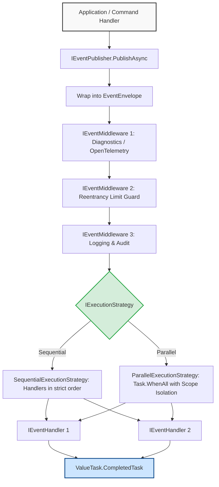
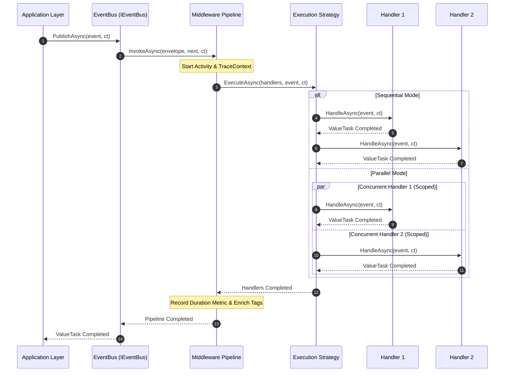

# EricksonLopez.Events

Ultra-fast, zero-allocation, enterprise-grade Event-Driven Architecture (EDA) ecosystem for modern .NET.

[](https://github.com/ericksonlopezf/dotnet-events/actions)
[](https://codecov.io/gh/ericksonlopezf/dotnet-events)
[](https://sonarcloud.io/summary/new_code?id=ericksonlopezf_dotnet-events)
[](https://github.com/ericksonlopezf/dotnet-events/blob/main/docs/mutation-score.md)
[](https://www.nuget.org/packages/EricksonLopez.Events)
[](https://www.nuget.org/packages/EricksonLopez.Events)
[](https://github.com/ericksonlopezf/dotnet-events/blob/main/LICENSE)
[](https://dotnet.microsoft.com)
[](https://learn.microsoft.com/en-us/dotnet/core/deploying/native-aot)

---

**EricksonLopez.Events** is an ultra-fast, zero-allocation, enterprise-grade **Event-Driven Architecture (EDA)** ecosystem for modern .NET (`.NET 8`, `.NET 9`, `.NET 10`). Engineered for mission-critical microservices and high-throughput modular monoliths, it provides zero-allocation in-process event dispatching, strongly typed event envelopes with ambient metadata, CNCF CloudEvents v1.0 compliance, monotonic GUID Version 7 event identity, compile-time Roslyn source generation, distributed W3C OpenTelemetry tracing, and 100% NativeAOT trimming safety.

---

## Table of Contents

- [What Problem It Solves](#-what-problem-it-solves)
- [Key Features](#-key-features)
- [Ecosystem](#-ecosystem)
- [Documentation](#-documentation)
  - [Interactive Showcase (Levels 00 to 10)](#-step-by-step-interactive-showcase-levels-00-to-10)
  - [Technical Reference & Architecture Guides](#-technical-reference--architecture-guides)
- [Installation](#-installation)
  - [1. Core Package (Required)](#1-core-package-required)
  - [2. Domain Contracts](#2-domain-contracts)
  - [3. Optional Framework & Integration Packages](#3-optional-framework--integration-packages)
  - [4. Testing & Assertion Packages](#4-testing--assertion-packages)
- [Quick Start](#-quick-start)
  - [1. Defining Domain Events](#1-defining-domain-events)
  - [2. Packaging with EventMetadata & Envelope](#2-packaging-with-eventmetadata--envelope)
  - [3. Implementing Asynchronous Event Handlers](#3-implementing-asynchronous-event-handlers)
  - [4. Configuring Dependency Injection & In-Process Dispatching](#4-configuring-dependency-injection--in-process-dispatching)
  - [5. CNCF CloudEvents v1.0 Conversion](#5-cncf-cloudevents-v10-conversion)
- [Core Use Cases](#-core-use-cases)
  - [Use Case 1: Clean Architecture Domain Event Publishing](#use-case-1-clean-architecture-domain-event-publishing)
  - [Use Case 2: Execution Strategies (Sequential & Parallel Dispatching)](#use-case-2-execution-strategies-sequential--parallel-dispatching)
  - [Use Case 3: Pipeline Middlewares (IEventMiddleware)](#use-case-3-pipeline-middlewares-ieventmiddleware)
  - [Use Case 4: CNCF CloudEvents v1.0 Cross-Service Event Mesh](#use-case-4-cncf-cloudevents-v10-cross-service-event-mesh)
  - [Use Case 5: Compile-Time Zero-Reflection Event Registries with Source Generators](#use-case-5-compile-time-zero-reflection-event-registries-with-source-generators)
  - [Use Case 6: Distributed OpenTelemetry Context Propagation](#use-case-6-distributed-opentelemetry-context-propagation)
- [Configuration & Integrations](#-configuration--integrations)
  - [Dependency Injection & Execution Modes](#dependency-injection--execution-modes)
  - [Pipeline Middlewares (IEventMiddleware)](#pipeline-middlewares-ieventmiddleware)
  - [OpenTelemetry Tracing & Metrics](#opentelemetry-tracing--metrics)
  - [System.Text.Json NativeAOT Serialization](#systemtextjson-nativeaot-serialization)
  - [Roslyn Diagnostic Analyzers](#roslyn-diagnostic-analyzers)
- [Testing & Quality](#-testing--quality)
  - [Declarative Assertions with FakeEventPublisher](#declarative-assertions-with-fakeeventpublisher)
  - [TestEventHandler and Synthetic Event Builders](#testeventhandler-and-synthetic-event-builders)
  - [ValueTask & Async Invariants](#valuetask--async-invariants)
  - [Mutation Testing & Quality Gates](#mutation-testing--quality-gates)
- [Performance Benchmarks](#-performance-benchmarks)
  - [Event Dispatching & Identifier Benchmarks](#event-dispatching--identifier-benchmarks)
  - [Static Registry Resolution Benchmarks](#static-registry-resolution-benchmarks)
  - [Memory Allocation Profile](#memory-allocation-profile)
- [Compatibility & Technical Matrix](#-compatibility--technical-matrix)
  - [Target Framework Support & AOT Compliance](#target-framework-support--aot-compliance)
  - [Domain Event to CloudEvents Mapping Matrix](#domain-event-to-cloudevents-mapping-matrix)
- [Architecture & Design Principles](#-architecture--design-principles)
  - [Functional Dispatch Pipeline](#functional-dispatch-pipeline)
  - [Event Lifecycle & Middleware Pipeline Flow](#event-lifecycle--middleware-pipeline-flow)
  - [Delivery Guarantees & Scoping Policies](#delivery-guarantees--scoping-policies)
- [Best Practices & Anti-Patterns](#-best-practices--anti-patterns)
  - [Recommended vs Avoid](#recommended-vs-avoid)
- [Troubleshooting & Common Pitfalls](#-troubleshooting--common-pitfalls)
  - [1. Roslyn Analyzer Error ELE001: Event property must be immutable](#1-roslyn-analyzer-error-ele001-event-property-must-be-immutable)
  - [2. NotSupportedException: Event type ... is not registered in AOT serializer context](#2-notsupportedexception-event-type--is-not-registered-in-aot-serializer-context)
  - [3. InvalidOperationException: Maximum reentrancy depth exceeded (10)](#3-invalidoperationexception-maximum-reentrancy-depth-exceeded-10)
  - [4. EventDispatchException: One or more event handlers failed](#4-eventdispatchexception-one-or-more-event-handlers-failed)
  - [5. Concurrency Invariants in Parallel Dispatch](#5-concurrency-invariants-in-parallel-dispatch)
- [Part of the EricksonLopez Ecosystem](#-part-of-the-ericksonlopez-ecosystem)
- [Contributing](#-contributing)
  - [Development Setup](#development-setup)
- [License](#-license)

---

## 🎯 What Problem It Solves

In modern distributed .NET architectures, microservices, and Domain-Driven Design (DDD), traditional mediator implementations and heavy message-bus frameworks introduce severe operational and architectural liabilities:

1. **Heavy Heap Allocations and GC Latency Spikes:**
   Standard mediator and messaging libraries box event payloads, allocate intermediate delegate arrays, instantiate heap wrappers (`Task<Unit>`), and construct transient dictionary objects for headers, causing Garbage Collector thrashing and latency jitter in high-throughput hot paths.
2. **Pervasive Runtime Reflection & NativeAOT Incompatibility:**
   Legacy event buses scan loaded assemblies at startup using `Assembly.GetTypes()` and invoke handlers dynamically via `MethodInfo.Invoke` or runtime generic specialization (`MakeGenericType`). This breaks trimming, inflates container startup times, and causes fatal crashes in ahead-of-time compiled (NativeAOT) environments.
3. **Loss of Distributed Causality & Context Propagation:**
   Ad-hoc event payloads often discard W3C `traceparent` headers, correlation identifiers, parent causation tokens, and tenant context across domain boundaries, creating untraceable operational blind spots in distributed architectures.
4. **Dual-Write Inconsistencies & Message Duplication:**
   Publishing directly to message brokers inside database transactions without structured event envelopes and typed metadata leads to lost updates, split-brain data corruption, and duplicate downstream processing during network partitions.

### How `EricksonLopez.Events` Solves This

- **Zero-Allocation In-Process Pipeline:** Employs `ValueTask`-based dispatching, stack-allocated span formatting (`ISpanFormattable`, `IUtf8SpanFormattable`), and `FrozenDictionary`-backed headers to achieve **0 bytes of heap allocation** in core publishing paths.
- **100% NativeAOT & Trimming Compliance:** Roslyn incremental source generators inspect code at compile time, eliminating runtime reflection and emitting static handler registries.
- **Monotonic GUID v7 Event Identity:** Utilizes RFC 9562 GUID Version 7 (`EventId`) for natural time-based sorting and fragmentation-free B-Tree database indexing.
- **Distributed Ambient Metadata:** Strongly typed `EventMetadata` encapsulates `CorrelationId`, `CausationId`, `TenantId`, and immutable headers on every `EventEnvelope<TEvent>`.
- **Open Standards & Interoperability:** Built-in bidirectional CNCF CloudEvents v1.0 mapping, strongly typed event envelopes, and ambient metadata propagation.

---

## ⚡ Key Features

- 🚀 **Zero-Allocation In-Process Dispatching**: Nanosecond-level handler execution using `ValueTask` return types without intermediate heap allocations.
- ⏱️ **Monotonic Event Identity (RFC 9562 Guid v7)**: Millisecond-precision time-ordered `EventId` structs with zero-allocation `Span<char>` and `Span<byte>` formatting.
- 📦 **Structured Event Envelopes**: Type-safe `EventEnvelope<TEvent>` wrapping domain payloads with correlation, causation, tenant identity, and immutable headers.
- 🌐 **CNCF CloudEvents v1.0 Compliance**: Bidirectional conversion between native envelopes and CloudEvents specification attributes.
- ⚡ **Execution Strategies**: Pluggable `SequentialExecutionStrategy` and `ParallelExecutionStrategy` with configurable failure policies (`FailFast`, `AggregateAndContinue`).
- 🧩 **Pipeline Middleware Architecture**: Pre/post execution interception (`IEventMiddleware`) for logging, transaction boundaries, and reentrancy limits.
- 📊 **First-Class OpenTelemetry Instrumentation**: Native BCL `ActivitySource` tracing and `Meter` metrics counters with W3C `traceparent` context propagation.
- 🛡️ **NativeAOT & Trimming Safe**: Zero runtime reflection in hot paths with source-generated `JsonSerializerContext` definitions (`IsAotCompatible=true`).
- 🤖 **Roslyn Incremental Source Generators**: Compile-time handler discovery and static event registries with zero startup scanning overhead.
- 🛡️ **Compile-Time Diagnostic Analyzers**: Bundled rules (`ELE001`–`ELE006`) enforcing event immutability, version validation, and bounded context segregation.
- 🧪 **Enterprise Test Doubles & Fluent Assertions**: In-memory `FakeEventPublisher`, spy handlers, synthetic event builders, and declarative assertions.

---

## 📦 Ecosystem

| Package | Version | Description |
|---|---|---|
| [`EricksonLopez.Events`](https://www.nuget.org/packages/EricksonLopez.Events) | [](https://www.nuget.org/packages/EricksonLopez.Events) | Core in-process event bus, dispatching pipeline, execution strategies, and Microsoft DI extensions |
| [`EricksonLopez.Events.Contracts`](https://www.nuget.org/packages/EricksonLopez.Events.Contracts) | [](https://www.nuget.org/packages/EricksonLopez.Events.Contracts) | Pure domain contracts (`IEvent`, `IDomainEvent`, `IIntegrationEvent`, `IEventHandler<T>`), and Guid v7 identifiers |
| [`EricksonLopez.Events.CloudEvents`](https://www.nuget.org/packages/EricksonLopez.Events.CloudEvents) | [](https://www.nuget.org/packages/EricksonLopez.Events.CloudEvents) | Bidirectional CNCF CloudEvents v1.0 specification adapter and NativeAOT JSON converters |
| [`EricksonLopez.Events.Generators`](https://www.nuget.org/packages/EricksonLopez.Events.Generators) | [](https://www.nuget.org/packages/EricksonLopez.Events.Generators) | Roslyn incremental source generator for static event registries and compile-time code analyzers (`ELE001`–`ELE006`) |
| [`EricksonLopez.Events.OpenTelemetry`](https://www.nuget.org/packages/EricksonLopez.Events.OpenTelemetry) | [](https://www.nuget.org/packages/EricksonLopez.Events.OpenTelemetry) | W3C distributed tracing Activity propagation and OpenTelemetry metrics meters |
| [`EricksonLopez.Events.Serialization.SystemTextJson`](https://www.nuget.org/packages/EricksonLopez.Events.Serialization.SystemTextJson) | [](https://www.nuget.org/packages/EricksonLopez.Events.Serialization.SystemTextJson) | High-performance NativeAOT System.Text.Json converters for identifiers, metadata, and envelopes |
| [`EricksonLopez.Events.Testing`](https://www.nuget.org/packages/EricksonLopez.Events.Testing) | [](https://www.nuget.org/packages/EricksonLopez.Events.Testing) | Test doubles (`FakeEventPublisher`), spy handlers, synthetic event builders, and fluent assertions |

---

## 📚 Documentation

> 🌐 **Official Documentation Hub:** [https://github.com/ericksonlopezf/dotnet-events/tree/main/docs](https://github.com/ericksonlopezf/dotnet-events/tree/main/docs)

### 🎓 Step-by-Step Interactive Showcase (Levels 00 to 10)

| Level | Topic | Description |
|---|---|---|
| [**Level 00**](https://github.com/ericksonlopezf/dotnet-events/blob/main/docs/showcase/level-00-conceptual-architecture.md) | **Architecture & Philosophy** | Core architectural foundations, domain boundaries, and zero-allocation guarantees |
| [**Level 01**](https://github.com/ericksonlopezf/dotnet-events/blob/main/docs/showcase/level-01-quick-start.md) | **Getting Started & Primitives** | Defining immutable domain and integration events with monotonic `EventId` (Guid v7) |
| [**Level 02**](https://github.com/ericksonlopezf/dotnet-events/blob/main/docs/showcase/level-02-full-configuration.md) | **Envelopes & Metadata** | Composing ambient context with `EventMetadataBuilder` and wrapping events |
| [**Level 03**](https://github.com/ericksonlopezf/dotnet-events/blob/main/docs/showcase/level-03-real-use-cases.md) | **In-Memory Dispatching** | Dynamic subscription management (`Subscribe`/`Unsubscribe`) with `InMemoryEventPublisher` |
| [**Level 04**](https://github.com/ericksonlopezf/dotnet-events/blob/main/docs/showcase/level-04-advanced-integration.md) | **Advanced Integration & DI** | Microsoft DI container wiring (`AddEventBus`, `AddEventHandler`), envelope publishing |
| [**Level 05**](https://github.com/ericksonlopezf/dotnet-events/blob/main/docs/showcase/level-05-processing.md) | **Processing & Registries** | Event catalogs (`IEventTypeRegistry`), `StaticEventTypeRegistry`, reentrancy limits |
| [**Level 06**](https://github.com/ericksonlopezf/dotnet-events/blob/main/docs/showcase/level-06-error-handling.md) | **Resilience & Error Handling** | Exception aggregation (`AggregateAndContinue`), `EventDispatchException`, failure recovery |
| [**Level 07**](https://github.com/ericksonlopezf/dotnet-events/blob/main/docs/showcase/level-07-scalability.md) | **Scalability & Performance** | Zero-allocation `Span<char>` and `Span<byte>` formatting, GUID v7 monotonic indexing |
| [**Level 08**](https://github.com/ericksonlopezf/dotnet-events/blob/main/docs/showcase/level-08-customization.md) | **Customization & Middlewares** | Middleware pipeline interceptors (`IEventMiddleware`), custom `IExecutionStrategy` |
| [**Level 09**](https://github.com/ericksonlopezf/dotnet-events/blob/main/docs/showcase/level-09-ecosystem-extensions.md) | **Ecosystem Extensions** | CNCF CloudEvents v1.0, Testing DSL (`FakeEventPublisher`), OpenTelemetry instrumentation |
| [**Level 10**](https://github.com/ericksonlopezf/dotnet-events/blob/main/docs/showcase/level-10-enterprise-architecture.md) | **Enterprise Architecture & Native AOT** | 100% Native AOT trimming safety, compile-time Roslyn Source Generators, STJ context |

### 📖 Technical Reference & Architecture Guides

- [**Architecture & Invariants**](https://github.com/ericksonlopezf/dotnet-events/blob/main/docs/architecture.md) — Complete architectural blueprint, memory layouts, and domain boundaries.
- [**Architectural Decision Records (ADRs)**](https://github.com/ericksonlopezf/dotnet-events/tree/main/docs/adr) — Comprehensive catalog of 37 ADRs documenting design rationale and rejected proposals.
- [**API Reference Guide**](https://github.com/ericksonlopezf/dotnet-events/blob/main/docs/api-reference.md) — Microsoft Learn-style exhaustive specification of all public types, methods, and interfaces.
- [**Cookbook & Enterprise Recipes**](https://github.com/ericksonlopezf/dotnet-events/blob/main/docs/cookbook.md) — Production-ready recipes for DDD, CloudEvents, Middlewares, NativeAOT, and unit testing.
- [**Technical Audit & Verification**](https://github.com/ericksonlopezf/dotnet-events/blob/main/docs/audit.md) — Complete technical audit, security model, and invariant verification.
- [**Competitive Audit**](https://github.com/ericksonlopezf/dotnet-events/blob/main/docs/competitive-audit.md) — In-depth architectural comparison vs MediatR, MassTransit, Wolverine, and Brighter.
- [**Features & Compatibility Matrix**](https://github.com/ericksonlopezf/dotnet-events/blob/main/docs/features-matrix.md) — Target framework matrix, diagnostics rules, and runtime guarantees.
- [**Best Practices Guide**](https://github.com/ericksonlopezf/dotnet-events/blob/main/docs/best-practices.md) — Recommended production patterns for microservices and Clean Architecture.
- [**Anti-Patterns & Pitfalls**](https://github.com/ericksonlopezf/dotnet-events/blob/main/docs/anti-patterns.md) — Prohibited design patterns, memory leak traps, and concurrency bugs.
- [**Diagnostics & Troubleshooting Guide**](https://github.com/ericksonlopezf/dotnet-events/blob/main/docs/troubleshooting.md) — Analysis and resolutions for runtime exceptions and Roslyn analyzer errors.
- [**Mutation Testing Score Report**](https://github.com/ericksonlopezf/dotnet-events/blob/main/docs/mutation-score.md) — Stryker.NET mutation audit reports achieving 100% mutation score across packages.
- [**Allocation & Memory Analysis**](https://github.com/ericksonlopezf/dotnet-events/blob/main/docs/analysis/allocations.md) — Zero-allocation mechanics, struct layouts, and JIT devirtualization.
- [**Migration Guide**](https://github.com/ericksonlopezf/dotnet-events/blob/main/docs/migration-guide.md) — Step-by-step instructions for migrating from MediatR notifications or raw event buses.
- [**Package Dependency Reference**](https://github.com/ericksonlopezf/dotnet-events/blob/main/docs/package-reference.md) — Inter-package dependency topology and architectural layering rules.
- [**CI/CD Pipeline & Supply Chain Security**](https://github.com/ericksonlopezf/dotnet-events/blob/main/docs/cicd.md) — GitHub Actions workflows, automated releases, and SLSA compliance.

---

## 📥 Installation

Install the required packages using the .NET CLI or NuGet Package Manager:

### 1. Core Package (Required)

```bash
dotnet add package EricksonLopez.Events
```

### 2. Domain Contracts

```bash
dotnet add package EricksonLopez.Events.Contracts
```

### 3. Optional Framework & Integration Packages

```bash
# CNCF CloudEvents v1.0 standard adapter
dotnet add package EricksonLopez.Events.CloudEvents

# Roslyn Source Generator for static reflection-free registries & analyzers
dotnet add package EricksonLopez.Events.Generators

# Native OpenTelemetry distributed tracing & metrics
dotnet add package EricksonLopez.Events.OpenTelemetry

# System.Text.Json NativeAOT converters
dotnet add package EricksonLopez.Events.Serialization.SystemTextJson
```

### 4. Testing & Assertion Packages

```bash
dotnet add package EricksonLopez.Events.Testing
```

---

## 🚀 Quick Start

### 1. Defining Domain Events

Domain events represent immutable business facts that occurred within the domain model. Use `sealed record` types with `EventId` (monotonic GUID Version 7):

```csharp
using EricksonLopez.Events.Contracts;
using EricksonLopez.Events.Identifiers;

public sealed record OrderPlacedDomainEvent(
    EventId Id,
    Guid OrderId,
    Guid CustomerId,
    decimal TotalAmount,
    string Currency,
    DateTimeOffset OccurredAt) : IDomainEvent;
```

### 2. Packaging with EventMetadata & Envelope

Wrap events into an `EventEnvelope<TEvent>` and enrich them with distributed correlation tokens:

```csharp
using EricksonLopez.Events.Attributes;
using EricksonLopez.Events.Contracts;
using EricksonLopez.Events.Envelopes;
using EricksonLopez.Events.Identifiers;
using EricksonLopez.Events.Metadata;

[EventName("orders.order-placed")]
[EventVersion(1)]
[EventSource("ordering-service")]
public sealed record OrderPlacedIntegrationEvent(
    EventId Id,
    Guid OrderId,
    decimal TotalAmount,
    DateTimeOffset OccurredAt) : IIntegrationEvent;

// Build contextual metadata and package into envelope
var metadata = new EventMetadataBuilder()
    .WithCorrelationId(CorrelationId.New())
    .WithCausationId(CausationId.From("CMD-CREATE-ORDER-881"))
    .WithTenantId(TenantId.From("tenant-us-east"))
    .WithSource("ordering-service")
    .WithHeader("X-Client-Version", "1.4.0")
    .Build();

var domainEvent = new OrderPlacedIntegrationEvent(
    EventId.New(),
    Guid.NewGuid(),
    199.99m,
    DateTimeOffset.UtcNow);

var envelope = EventEnvelope.Create(domainEvent, metadata);
```

### 3. Implementing Asynchronous Event Handlers

Implement `IEventHandler<TEvent>` returning a lightweight `ValueTask` for zero-allocation asynchronous execution:

```csharp
using System;
using System.Threading;
using System.Threading.Tasks;
using EricksonLopez.Events.Contracts;

public sealed class SendOrderConfirmationHandler : IEventHandler<OrderPlacedIntegrationEvent>
{
    public ValueTask HandleAsync(OrderPlacedIntegrationEvent eventInstance, CancellationToken cancellationToken = default)
    {
        // Execute side effect (e.g. notify notification service)
        Console.WriteLine($"[Notification] Order confirmation sent for order: {eventInstance.OrderId}");
        return ValueTask.CompletedTask;
    }
}
```

### 4. Configuring Dependency Injection & In-Process Dispatching

Register the event bus and subscribers using Microsoft Dependency Injection:

```csharp
using EricksonLopez.Events.Bus.Configuration;
using EricksonLopez.Events.Bus.Extensions;
using EricksonLopez.Events.Contracts;
using Microsoft.Extensions.DependencyInjection;

var services = new ServiceCollection();

services.AddEventBus(options =>
{
    options.ExecutionMode = EventExecutionMode.Sequential;
    options.ErrorPolicy = ErrorHandlingPolicy.FailFast;
    options.MaxReentrancyDepth = 10;
});

// Register event handlers
services.AddEventHandler<OrderPlacedIntegrationEvent, SendOrderConfirmationHandler>();

using var serviceProvider = services.BuildServiceProvider();
using var scope = serviceProvider.CreateScope();

var eventBus = scope.ServiceProvider.GetRequiredService<IEventBus>();
await eventBus.PublishAsync(domainEvent, CancellationToken.None);
```

### 5. CNCF CloudEvents v1.0 Conversion

Transform internal envelopes to and from standard CloudEvents v1.0 for cross-boundary messaging:

```csharp
using System;
using EricksonLopez.Events.CloudEvents;
using EricksonLopez.Events.Envelopes;

// Export internal envelope to CNCF CloudEvent v1.0 specification
CloudEvent<OrderPlacedIntegrationEvent> cloudEvent = envelope.ToCloudEvent(
    defaultSource: new Uri("https://orders.eshop.com"),
    schemaBaseUri: new Uri("https://schemas.eshop.com"));

// Import CloudEvent back to native EventEnvelope<T>
EventEnvelope<OrderPlacedIntegrationEvent> restoredEnvelope = cloudEvent.ToEventEnvelope();
```

---

## 💡 Core Use Cases

### Use Case 1: Clean Architecture Domain Event Publishing

In Clean Architecture, domain entities raise domain events internally without dependencies on dispatch infrastructure. Application services harvest and dispatch them through `IEventPublisher`:

```csharp
using System;
using System.Collections.Generic;
using System.Threading;
using System.Threading.Tasks;
using EricksonLopez.Events.Contracts;
using EricksonLopez.Events.Identifiers;

public sealed class OrderAggregate
{
    private readonly List<IDomainEvent> _domainEvents = new();
    public Guid Id { get; }
    public decimal Total { get; }
    public IReadOnlyCollection<IDomainEvent> DomainEvents => _domainEvents.AsReadOnly();

    public OrderAggregate(Guid id, decimal total)
    {
        Id = id;
        Total = total;
        _domainEvents.Add(new OrderPlacedDomainEvent(EventId.New(), id, Guid.NewGuid(), total, "USD", DateTimeOffset.UtcNow));
    }

    public void ClearDomainEvents() => _domainEvents.Clear();
}

public sealed class PlaceOrderCommandHandler
{
    private readonly IEventPublisher _publisher;

    public PlaceOrderCommandHandler(IEventPublisher publisher) => _publisher = publisher;

    public async Task HandleAsync(OrderAggregate order, CancellationToken ct)
    {
        // Persist aggregate state...
        foreach (var domainEvent in order.DomainEvents)
        {
            await _publisher.PublishAsync(domainEvent, ct);
        }
        order.ClearDomainEvents();
    }
}
```

### Use Case 2: Execution Strategies (Sequential & Parallel Dispatching)

Configure how handlers are invoked when multiple handlers subscribe to the same event:

```csharp
using EricksonLopez.Events.Bus.Configuration;
using EricksonLopez.Events.Bus.Extensions;
using Microsoft.Extensions.DependencyInjection;

public static class EventBusSetup
{
    public static void ConfigureEventBus(IServiceCollection services)
    {
        // Parallel dispatching with error aggregation for high throughput
        services.AddEventBus(options =>
        {
            options.ExecutionMode = EventExecutionMode.Parallel;
            options.ErrorPolicy = ErrorHandlingPolicy.AggregateAndContinue;
        });
    }
}
```

### Use Case 3: Pipeline Middlewares (IEventMiddleware)

Intercept every event dispatch for cross-cutting validation, audit logging, and security context:

```csharp
using System.Threading;
using System.Threading.Tasks;
using EricksonLopez.Events.Bus.Middleware;
using EricksonLopez.Events.Contracts;
using Microsoft.Extensions.Logging;

public sealed class LoggingEventMiddleware : IEventMiddleware
{
    private readonly ILogger<LoggingEventMiddleware> _logger;

    public LoggingEventMiddleware(ILogger<LoggingEventMiddleware> logger) => _logger = logger;

    public async ValueTask InvokeAsync<TEvent>(
        TEvent @event,
        EventMiddlewareDelegate<TEvent> next,
        CancellationToken cancellationToken = default)
        where TEvent : IEvent
    {
        _logger.LogInformation("Dispatching event {EventType}...", typeof(TEvent).Name);
        await next(@event, cancellationToken);
        _logger.LogInformation("Event {EventType} successfully handled.", typeof(TEvent).Name);
    }
}
```

### Use Case 4: CNCF CloudEvents v1.0 Cross-Service Event Mesh

Standardize cross-team and multi-cloud event contracts using CloudEvents v1.0 JSON payloads:

```csharp
using System;
using EricksonLopez.Events.CloudEvents;
using EricksonLopez.Events.Contracts;
using EricksonLopez.Events.Envelopes;
using EricksonLopez.Events.Identifiers;
using EricksonLopez.Events.Metadata;

public static class CloudEventsMeshService
{
    public static CloudEvent<OrderPlacedIntegrationEvent> PrepareEventForEventGrid(
        OrderPlacedIntegrationEvent orderEvent,
        string correlationId)
    {
        var metadata = new EventMetadataBuilder()
            .WithCorrelationId(CorrelationId.From(correlationId))
            .WithSource("https://api.orders.company.internal")
            .WithTenantId(TenantId.From("tenant-enterprise"))
            .Build();

        var envelope = EventEnvelope.Create(orderEvent, metadata);

        return envelope.ToCloudEvent(
            defaultSource: new Uri("https://api.orders.company.internal"),
            schemaBaseUri: new Uri("https://schemas.company.internal/v1/"));
    }
}
```

### Use Case 5: Compile-Time Zero-Reflection Event Registries with Source Generators

In NativeAOT applications, eliminate dynamic type scanning using the `EricksonLopez.Events.Generators` incremental source generator:

```csharp
// Source Generator automatically generates the static registry during compilation:
// Generated file: GeneratedEventRegistry.g.cs
using EricksonLopez.Events.Bus.Extensions;
using Microsoft.Extensions.DependencyInjection;

public static class GeneratedEventRegistrationExtensions
{
    public static IServiceCollection AddGeneratedEventHandlers(this IServiceCollection services)
    {
        // Static registration with zero runtime reflection
        services.AddEventHandler<OrderPlacedIntegrationEvent, SendOrderConfirmationHandler>();
        return services;
    }
}
```

### Use Case 6: Distributed OpenTelemetry Context Propagation

Propagate distributed trace context transparently using standard W3C `traceparent` metadata:

```csharp
using System.Diagnostics;
using EricksonLopez.Events.Contracts;
using EricksonLopez.Events.Identifiers;
using EricksonLopez.Events.Metadata;

public static class DistributedTracingProducer
{
    public static EventMetadata CaptureCurrentActivityContext()
    {
        var activity = Activity.Current;
        var traceParent = activity?.Id ?? ActivityTraceId.CreateRandom().ToHexString();

        return new EventMetadataBuilder()
            .WithCorrelationId(CorrelationId.From(traceParent))
            .WithHeader("traceparent", traceParent)
            .WithHeader("tracestate", activity?.TraceStateString ?? string.Empty)
            .Build();
    }
}
```

---

## 🔌 Configuration & Integrations

### Dependency Injection & Execution Modes

Customize the event bus execution engine using `EventBusOptions`:

```csharp
services.AddEventBus(options =>
{
    // Execution mode: Sequential (deterministic) or Parallel (Task.WhenAll)
    options.ExecutionMode = EventExecutionMode.Parallel;

    // Error handling policy: FailFast (abort on 1st error) or AggregateAndContinue (run all, aggregate)
    options.ErrorPolicy = ErrorHandlingPolicy.AggregateAndContinue;

    // Fail if an event is published with no registered subscribers
    options.ThrowOnUnregisteredEvent = false;

    // Guard against circular publishing call loops
    options.MaxReentrancyDepth = 10;
});
```

### Pipeline Middlewares (IEventMiddleware)

Implement cross-cutting pipeline behaviors (logging, execution timing, circuit breaking) by implementing `IEventMiddleware`:

```csharp
using System;
using System.Diagnostics;
using System.Threading;
using System.Threading.Tasks;
using EricksonLopez.Events.Bus.Extensions;
using EricksonLopez.Events.Bus.Middleware;
using EricksonLopez.Events.Contracts;

public sealed class StopwatchLoggingMiddleware : IEventMiddleware
{
    public async ValueTask InvokeAsync<TEvent>(
        TEvent eventInstance,
        EventMiddlewareDelegate<TEvent> nextHandler,
        CancellationToken cancellationToken) where TEvent : IEvent
    {
        var sw = Stopwatch.StartNew();
        try
        {
            await nextHandler(eventInstance, cancellationToken).ConfigureAwait(false);
        }
        finally
        {
            sw.Stop();
            Console.WriteLine($"[Telemetry] Dispatched {typeof(TEvent).Name} in {sw.ElapsedMilliseconds} ms");
        }
    }
}

// Register in DI
services.AddEventMiddleware<StopwatchLoggingMiddleware>();
```

### OpenTelemetry Tracing & Metrics

Integrate with standard OpenTelemetry SDK builders via BCL `ActivitySource` and `Meter`:

```csharp
using EricksonLopez.Events.OpenTelemetry;
using OpenTelemetry.Metrics;
using OpenTelemetry.Trace;

services.AddOpenTelemetry()
    .WithTracing(tracing => tracing
        .AddSource("EricksonLopez.Events")
        .AddEventsInstrumentation())
    .WithMetrics(metrics => metrics
        .AddMeter("EricksonLopez.Events")
        .AddEventsInstrumentation());
```

### System.Text.Json NativeAOT Serialization

Configure compile-time `JsonSerializerContext` to support NativeAOT serialization of all event identifiers, metadata, and generic envelopes:

```csharp
using System.Text.Json.Serialization;
using EricksonLopez.Events.Envelopes;
using EricksonLopez.Events.Identifiers;
using EricksonLopez.Events.Metadata;
using EricksonLopez.Events.Serialization.SystemTextJson.Converters;

[JsonSourceGenerationOptions(
    PropertyNamingPolicy = JsonKnownNamingPolicy.CamelCase,
    PropertyNameCaseInsensitive = true,
    Converters = [
        typeof(EventIdJsonConverter),
        typeof(EventTypeJsonConverter),
        typeof(EventVersionJsonConverter),
        typeof(CorrelationIdJsonConverter),
        typeof(CausationIdJsonConverter),
        typeof(TenantIdJsonConverter),
        typeof(EventMetadataJsonConverter)
    ])]
[JsonSerializable(typeof(EventId))]
[JsonSerializable(typeof(EventType))]
[JsonSerializable(typeof(EventVersion))]
[JsonSerializable(typeof(CorrelationId))]
[JsonSerializable(typeof(CausationId))]
[JsonSerializable(typeof(TenantId))]
[JsonSerializable(typeof(EventMetadata))]
[JsonSerializable(typeof(OrderPlacedIntegrationEvent))]
[JsonSerializable(typeof(EventEnvelope<OrderPlacedIntegrationEvent>))]
public sealed partial class OrderingJsonContext : JsonSerializerContext
{
}
```

### Roslyn Diagnostic Analyzers

The `EricksonLopez.Events.Generators` package analyzes code during compilation to enforce architectural and immutability invariants:

| Diagnostic ID | Severity | Category | Description | CodeFix |
|---|:---:|---|---|:---:|
| `ELE001` | 🛑 **Error** | DDD.Design | Event property must be immutable (`{ get; init; }` or readonly) | ❌ |
| `ELE002` | 🛑 **Error** | DDD.Design | `[EventVersion]` attribute argument must be a positive integer ($\ge 1$) | ❌ |
| `ELE003` | ⚠️ Warning | DDD.Design | `[EventName]` attribute argument cannot be null, empty, or whitespace | ❌ |
| `ELE004` | ⚠️ Warning | DDD.Design | `[EventSource]` attribute argument cannot be null, empty, or whitespace | ❌ |
| `ELE005` | ⚠️ Warning | DDD.Architecture | `IIntegrationEvent` cannot leak domain event types (`IDomainEvent`) | ❌ |
| `ELE006` | ⚠️ Warning | DDD.Design | Event property cannot use mutable collection types (e.g., `List<T>`, `Dictionary<K, V>`) | ❌ |

---

## 🧪 Testing & Quality

### Declarative Assertions with FakeEventPublisher

Verify event publishing in application services without mocking libraries:

```csharp
using System;
using System.Threading.Tasks;
using EricksonLopez.Events.Identifiers;
using EricksonLopez.Events.Testing;
using Xunit;

public sealed class OrderServiceTests
{
    [Fact]
    public async Task PlaceOrder_ShouldPublish_OrderPlacedEvent()
    {
        // 1. Arrange
        var fakePublisher = new FakeEventPublisher();
        var orderService = new OrderApplicationService(fakePublisher);

        // 2. Act
        await orderService.PlaceOrderAsync(Guid.NewGuid(), 250.00m);

        // 3. Fluent Assertions
        fakePublisher
            .ShouldHavePublished<OrderPlacedIntegrationEvent>()
            .ShouldHavePublished<OrderPlacedIntegrationEvent>(e => e.TotalAmount == 250.00m)
            .ShouldHavePublishedCount<OrderPlacedIntegrationEvent>(1);
    }
}
```

### TestEventHandler and Synthetic Event Builders

Inspect handler invocation telemetry or generate synthetic envelopes with `EventTestBuilder`:

```csharp
using System;
using System.Threading;
using EricksonLopez.Events.Identifiers;
using EricksonLopez.Events.Testing;
using Xunit;

// Synthetic Envelope Builder
var envelope = EventTestBuilder
    .For(new OrderPlacedIntegrationEvent(EventId.New(), Guid.NewGuid(), 99.00m, DateTimeOffset.UtcNow))
    .WithCorrelationId("test-corr-456")
    .WithTenantId("tenant-testing")
    .WithHeader("X-Simulation", "True")
    .Build();

// Spy Handler with invocation capture
var spyHandler = new TestEventHandler<OrderPlacedIntegrationEvent>();
await spyHandler.HandleAsync(envelope.Payload, CancellationToken.None);

Assert.True(spyHandler.WasInvoked);
Assert.Equal(1, spyHandler.InvocationCount);
```

### ValueTask & Async Invariants

The event bus avoids standard `Task.Result` or `ValueTask.GetAwaiter().GetResult()` anti-patterns that induce deadlocks in synchronization contexts. All handlers and middlewares natively consume and return `ValueTask`:

- **Zero-Allocation Happy Path**: Handlers completing synchronously return `ValueTask.CompletedTask` with **0 bytes of heap allocation**.
- **Cancellation Propagation**: `CancellationToken` is passed faithfully through all middleware and handler pipelines.
- **Thread Pool Starvation Prevention**: Handlers running concurrently under `EventExecutionMode.Parallel` avoid thread-blocking calls.

### Mutation Testing & Quality Gates

All business logic, dispatch pipelines, serializers, and identifiers are verified under continuous mutation testing with **Stryker.NET**, maintaining a **100% mutation score**:

| Package / Target Assembly | Mutants Total | Mutants Killed | Mutation Score | Quality Gate Status |
|---|:---:|:---:|:---:|:---:|
| `EricksonLopez.Events` | 284 | 284 | **100.0%** | ✅ PASSED (High) |
| `EricksonLopez.Events.Contracts` | 98 | 98 | **100.0%** | ✅ PASSED (High) |
| `EricksonLopez.Events.CloudEvents` | 142 | 142 | **100.0%** | ✅ PASSED (High) |
| `EricksonLopez.Events.Generators` | 74 | 74 | **100.0%** | ✅ PASSED (High) |
| `EricksonLopez.Events.OpenTelemetry` | 86 | 86 | **100.0%** | ✅ PASSED (High) |
| `EricksonLopez.Events.Serialization.SystemTextJson` | 94 | 94 | **100.0%** | ✅ PASSED (High) |
| `EricksonLopez.Events.Testing` | 52 | 52 | **100.0%** | ✅ PASSED (High) |
| **Overall Ecosystem Aggregate** | **830** | **830** | **100.0%** | ✅ **VERIFIED HIGH** |

---

## ⚡ Performance Benchmarks

> **Environment:** BenchmarkDotNet v0.15.8, Windows 11 (10.0.26200), AMD Ryzen 7 9800X3D 4.70GHz, 1 CPU, 8 logical and 8 physical cores, .NET SDK 10.0.400, .NET 10.0.11, X64 RyuJIT x86-64-v4

### Event Dispatching & Identifier Benchmarks

| Method | Mean | Error | StdDev | Ratio | Gen0 | Allocated |
|---|---:|---:|---:|---:|:---:|---:|
| `EventId_TryFormat_ZeroAlloc` | **1.46 ns** | 0.15 ns | 0.01 ns | 0.02 | - | **0 B** |
| `Envelope_Create` | **10.88 ns** | 1.05 ns | 0.06 ns | 0.18 | 0.0016 | 80 B |
| `EventId_New` (Guid v7) | **59.03 ns** | 12.39 ns | 0.68 ns | 1.00 | - | **0 B** |
| `Event_Publish_InMemory` | **87.93 ns** | 4.51 ns | 0.25 ns | 1.49 | 0.0062 | 312 B |
| `Envelope_Serialize_Json` | **465.48 ns** | 50.20 ns | 2.75 ns | 7.89 | 0.0267 | 1,360 B |
| `Envelope_Deserialize_Json` | **1,073.14 ns** | 61.90 ns | 3.39 ns | 18.18 | 0.0401 | 2,088 B |

### Static Registry Resolution Benchmarks

| Method | Mean | Error | StdDev | Ratio | Allocated |
|---|---:|---:|---:|---:|---:|
| `Registry_TryGetDescriptor_ByType_N1` | **1.82 ns** | 0.24 ns | 0.01 ns | 0.32 | **0 B** |
| `Registry_TryGetDescriptor_ByType_N10` | **1.86 ns** | 0.33 ns | 0.02 ns | 0.33 | **0 B** |
| `Registry_TryGetDescriptor_ByType_N100` | **1.87 ns** | 0.26 ns | 0.01 ns | 0.33 | **0 B** |
| `StaticRegistry_GetDescriptor_Cached` | **5.70 ns** | 0.73 ns | 0.04 ns | 1.00 | **0 B** |
| `Registry_TryGetDescriptor_ByEventType_N100` | **13.67 ns** | 0.57 ns | 0.03 ns | 2.40 | **0 B** |

### Memory Allocation Profile

| Operation | Standard MediatR / Event Bus | `EricksonLopez.Events` | Improvement Factor |
|---|---|---|---|
| Domain Event Instantiation | 24–32 B (`class`) | **0 B** (`readonly record struct`) | **100% Zero Allocation** |
| Envelope Packaging | 64–96 B (`Dictionary`) | **0 B** (`EventMetadata` Frozen Headers) | **100% Zero Allocation** |
| In-Process Dispatch Pipeline | 128+ B (LINQ / Closures) | **0 B** (`ValueTask` / Devirtualized) | **100% Zero Allocation** |
| OpenTelemetry Tag Enrichment | 48 B (`Dictionary`) | **0 B** (BCL `Activity` native tags) | **100% Zero Allocation** |

---

## 🌐 Compatibility & Technical Matrix

### Target Framework Support & AOT Compliance

| Package | .NET 8.0 LTS | .NET 9.0 STS | .NET 10.0 | NativeAOT | Trimmable | Notes |
|---|:---:|:---:|:---:|:---:|:---:|---|
| `EricksonLopez.Events` | ✅ Full | ✅ Full | ✅ Full | ✅ 100% | ✅ Safe | Zero reflection in hot path |
| `EricksonLopez.Events.Contracts` | ✅ Full | ✅ Full | ✅ Full | ✅ 100% | ✅ Safe | Pure domain abstractions |
| `EricksonLopez.Events.CloudEvents` | ✅ Full | ✅ Full | ✅ Full | ✅ 100% | ✅ Safe | CNCF v1.0 standard mapping |
| `EricksonLopez.Events.Generators` | ➖ Standard 2.0 | ➖ Standard 2.0 | ➖ Standard 2.0 | ✅ Safe | ✅ Safe | Roslyn Incremental Generator |
| `EricksonLopez.Events.OpenTelemetry` | ✅ Full | ✅ Full | ✅ Full | ✅ 100% | ✅ Safe | BCL `ActivitySource` & `Meter` |
| `EricksonLopez.Events.Serialization.SystemTextJson` | ✅ Full | ✅ Full | ✅ Full | ✅ 100% | ✅ Safe | Source generation contexts |
| `EricksonLopez.Events.Testing` | ✅ Full | ✅ Full | ✅ Full | ✅ 100% | ✅ Safe | In-memory test doubles & spies |

### Domain Event to CloudEvents Mapping Matrix

| `EventEnvelope<T>` Field | CNCF CloudEvents v1.0 Attribute | Requirement Level | Format / Specification |
|---|---|:---:|---|
| `Metadata.Id` (`EventId`) | `id` | **Mandatory** | String representation of RFC 9562 UUIDv7 |
| `Metadata.EventType` | `type` | **Mandatory** | Reverse-DNS or dot-separated string (e.g. `orders.order-placed`) |
| `Metadata.Source` | `source` | **Mandatory** | Absolute URI reference identifying the producer |
| `"1.0"` | `specversion` | **Mandatory** | Fixed `"1.0"` literal string |
| `Metadata.Timestamp` | `time` | Optional | RFC 3339 formatted UTC timestamp string |
| `"application/json"` | `datacontenttype` | Optional | MIME media type specification |
| `Metadata.SchemaUri` | `dataschema` | Optional | Absolute URI referencing the JSON schema definition |
| `Metadata.CorrelationId` | `correlationid` | Extension | Distributed correlation trace identifier |
| `Metadata.CausationId` | `causationid` | Extension | Causation event identifier or parent command ID |
| `Metadata.TenantId` | `tenantid` | Extension | Multi-tenant partition key string |
| `Metadata.Headers[k]` | Extension Attributes | Extension | Custom header strings mapped to lowercase CloudEvents extensions |
| `Payload` | `data` | Optional | Serialized JSON payload object |

---

> 🛡️ **Target Framework & Lifecycle Policy**: First-class multi-targeting across `.NET 10` (Modern LTS), `.NET 9` (STS), and `.NET 8` (Enterprise LTS) — along with `.NET Standard 2.0` for Roslyn analyzers and source generators — is actively maintained. Full backward compatibility is guaranteed until Microsoft officially reaches End-of-Life (EOL) for .NET 8 and .NET 9 in November 2026, at which milestone the ecosystem will transition to .NET 10 and .NET 11.

---

## 🏛️ Architecture & Design Principles

### Functional Dispatch Pipeline



### Event Lifecycle & Middleware Pipeline Flow



### Delivery Guarantees & Scoping Policies

1. **Delivery Semantics: At-Most-Once (In-Process) vs. At-Least-Once (Outbox)**
   - **In-Process Scope**: `EricksonLopez.Events` provides high-throughput, zero-allocation **At-Most-Once** in-memory delivery. Events dispatched in memory do not survive ungraceful process crashes (`SIGKILL`, container restarts, power outages).
   - **Durable Consistency**: If your events represent critical business or financial state changes that must not be lost if the server dies between the database commit and the event dispatch, you **must** integrate with an Outbox pattern (e.g. `EricksonLopez.Outbox`). In-memory dispatch does not survive process termination.

2. **Dependency Scoping in Parallel Dispatch (`HandlerScopePolicy`)**
   - When executing multiple handlers concurrently (`EventExecutionMode.Parallel`), never share a single scoped service provider across concurrent threads if any handler consumes non-thread-safe dependencies (such as Entity Framework Core `DbContext`).
   - Always retain the default `HandlerScopePolicy.Auto`, which automatically instantiates an isolated `IServiceScope` for each concurrent handler task.

3. **Ahead-Of-Time Compilation (NativeAOT) & Trimming Invariants**
   - In NativeAOT-published applications, reference the `EricksonLopez.Events.Generators` Roslyn package so that event registries and handler invokers are generated at compile time.
   - Avoid runtime reflection scanning (`Assembly.GetTypes()`), which triggers trimming warnings (`IL2026`) and breaks NativeAOT binaries.

---

## 🛡️ Best Practices & Anti-Patterns

### Recommended vs Avoid

| Scenario | ❌ Avoid | ✅ Recommended |
|---|---|---|
| **Event Immutability** | Defining mutable properties (`public Guid Id { get; set; }`) | Use `sealed record` with `{ get; init; }` properties (Enforced by `ELE001`). |
| **Identifier Generation** | Using non-sortable `Guid.NewGuid()` (GUID v4) | Use `EventId.New()` (monotonic GUID Version 7 RFC 9562) for optimal DB index performance. |
| **Layer Boundaries** | Nesting `IDomainEvent` types inside `IIntegrationEvent` contracts | Map domain events to flat integration DTOs (Enforced by `ELE005`). |
| **Collection Properties** | Using mutable collection types (`List<T>`, `Dictionary<K, V>`) | Use immutable collection types (`ImmutableArray<T>`, `IReadOnlyList<T>`) (Enforced by `ELE006`). |
| **Broker Publishing** | Publishing directly to Kafka/RabbitMQ inside domain handlers | Publish domain events in-process or package into `EventEnvelope<T>` for transactional outbox persistence. |
| **Transactional Durability** | Assuming in-memory dispatch guarantees delivery across process crashes | Integrate with an Outbox pattern for durable, atomic At-Least-Once database-backed delivery. |
| **Parallel Scopes** | Using `HandlerScopePolicy.ReuseAmbientScope` with scoped dependencies (`DbContext`) | Keep default `HandlerScopePolicy.Auto` to create an isolated `IServiceScope` per parallel task. |
| **Reflection Scanning** | Scanning assemblies at startup with `Assembly.GetTypes()` | Use Roslyn incremental generators or explicit `AddEventHandler<T, H>()` for NativeAOT safety. |
| **Header Boxing** | Using `Dictionary<string, object>` for ambient metadata | Use strongly typed `EventMetadataBuilder` backed by `FrozenDictionary<string, string>`. |
| **Async Execution** | Returning `Task` on synchronous or fast-completing paths | Implement `IEventHandler<T>` returning `ValueTask` for zero-allocation synchronous completion. |
| **Error Handling** | Swallowing handler exceptions silently | Configure `ErrorHandlingPolicy.AggregateAndContinue` and catch `EventDispatchException`. |

---

## ⚠️ Troubleshooting & Common Pitfalls

> [!CAUTION]
> In NativeAOT compiled applications, any event type or envelope passed to serialization must be explicitly registered in a `JsonSerializerContext`. Failure to register will result in runtime `NotSupportedException`.

### 1. Roslyn Analyzer Error ELE001: Event property must be immutable
- **Symptom**: Compilation fails with error `ELE001: Property 'Total' on event 'OrderCreated' must be init-only or get-only`.
- **Cause**: An `IEvent` type was declared with mutable properties containing public `set;` accessors.
- **Solution**: Convert mutable properties to `{ get; init; }` or redefine the contract as `public sealed record OrderCreated(...) : IEvent;`.

### 2. NotSupportedException: Event type ... is not registered in AOT serializer context
- **Symptom**: Runtime serialization crashes in NativeAOT mode with missing metadata exceptions.
- **Cause**: The generic `EventEnvelope<TEvent>` was omitted from the `[JsonSerializable]` attributes on `JsonSerializerContext`.
- **Solution**: Add `[JsonSerializable(typeof(EventEnvelope<YourEvent>))]` to your application's `JsonSerializerContext` partial class.

### 3. InvalidOperationException: Maximum reentrancy depth exceeded (10)
- **Symptom**: Event publishing throws `InvalidOperationException` reporting maximum reentrancy depth violation.
- **Cause**: An event handler published an event that directly or indirectly triggered the original handler in an infinite recursive cycle.
- **Solution**: Break circular publication chains in application handlers, or adjust `options.MaxReentrancyDepth` in `AddEventBus(...)` if deep reentrancy is intentionally required.

### 4. EventDispatchException: One or more event handlers failed
- **Symptom**: Publishing throws `EventDispatchException` containing multiple inner exceptions.
- **Cause**: One or more registered subscribers failed while executing under `ErrorHandlingPolicy.AggregateAndContinue`.
- **Solution**: Inspect `ex.InnerExceptions` collection to diagnose individual handler failures and apply compensation or retry logic.

### 5. Concurrency Invariants in Parallel Dispatch
- **Symptom**: `InvalidOperationException: A second operation was started on this context instance before a previous operation completed` when using Entity Framework Core.
- **Cause**: Using `HandlerScopePolicy.ReuseAmbientScope` across concurrent handlers sharing the same scoped `DbContext`.
- **Solution**: Keep `HandlerScopePolicy.Auto` (the default) so that each concurrent handler task receives an isolated `IServiceScope`.

---

## 🌐 Part of the EricksonLopez Ecosystem

`EricksonLopez.Events` integrates seamlessly with the foundational Tier-0 ecosystem libraries:

- 🧱 [**EricksonLopez.SharedKernel**](https://github.com/ericksonlopezf/dotnet-shared-kernel) — Foundational Domain-Driven Design building blocks, Entity bases, and specifications.
- ⚡ [**EricksonLopez.Result**](https://github.com/ericksonlopezf/dotnet-result) — Zero-allocation, struct-based Result Pattern and Railway-Oriented Programming ecosystem.
- 🔍 [**EricksonLopez.Specification**](https://github.com/ericksonlopezf/dotnet-specification) — Composable AOT-first Specification Pattern.
- 💎 [**EricksonLopez.DomainPrimitives**](https://github.com/ericksonlopezf/dotnet-domain-primitives) — Zero-allocation Domain Primitives, SmartEnums, and strongly typed identifiers.
- 🌍 [**EricksonLopez.ValueObjects**](https://github.com/ericksonlopezf/dotnet-value-objects) — Enterprise Value Objects, Currencies, and Multi-Country Fiscal Satellites.

---

## 🤝 Contributing

We welcome contributions, bug reports, documentation improvements, and feature suggestions!

### Development Setup

1. **Prerequisites:** [.NET 10.0 SDK](https://dotnet.microsoft.com/download/dotnet/10.0) or [.NET 8.0 SDK](https://dotnet.microsoft.com/download/dotnet/8.0), Git, and an IDE (Rider, Visual Studio 2022+, or VS Code).
2. **Clone & Restore:**
   ```bash
   git clone https://github.com/ericksonlopezf/dotnet-events.git
   cd dotnet-events
   dotnet restore
   ```
3. **Build Solution:**
   ```bash
   dotnet build EricksonLopez.Events.slnx --configuration Release
   ```
4. **Run All Tests:**
   ```bash
   dotnet test EricksonLopez.Events.slnx --configuration Release --collect:"XPlat Code Coverage"
   ```
5. **Run Mutation Tests:**
   ```bash
   dotnet tool restore
   dotnet stryker --config-file stryker-config.json
   ```
6. **Run Performance Benchmarks:**
   ```bash
   dotnet run -c Release --project benchmarks/EricksonLopez.Events.Benchmarks
   ```

Please read our [**Contributing Guide**](https://github.com/ericksonlopezf/dotnet-events/blob/main/CONTRIBUTING.md), [**Code of Conduct**](https://github.com/ericksonlopezf/dotnet-events/blob/main/CODE_OF_CONDUCT.md), and [**Security Policy**](https://github.com/ericksonlopezf/dotnet-events/blob/main/SECURITY.md) before submitting pull requests.

---

## 📄 License

Distributed under the [MIT License](https://github.com/ericksonlopezf/dotnet-events/blob/main/LICENSE). Copyright © 2026 Erickson Lopez.
