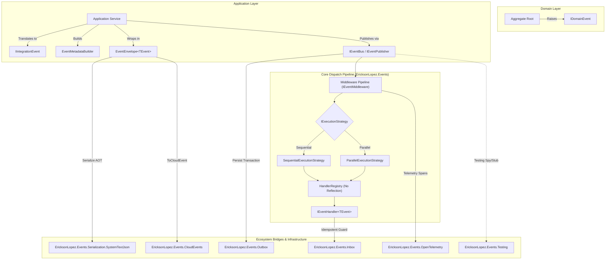
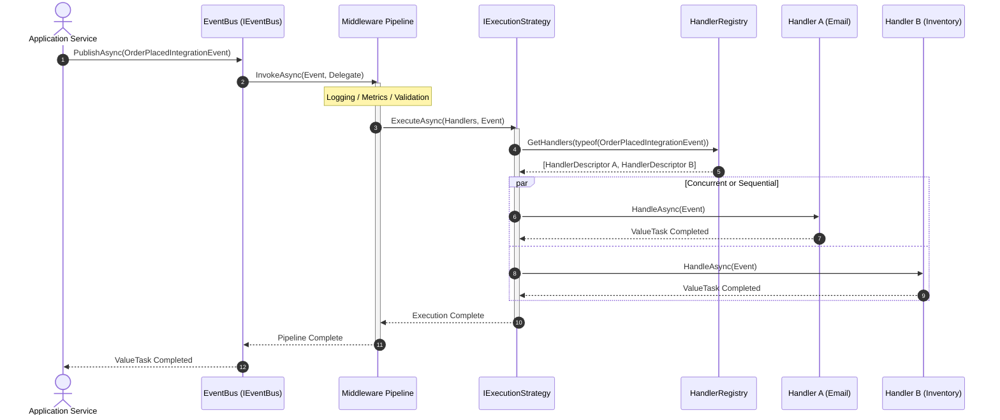
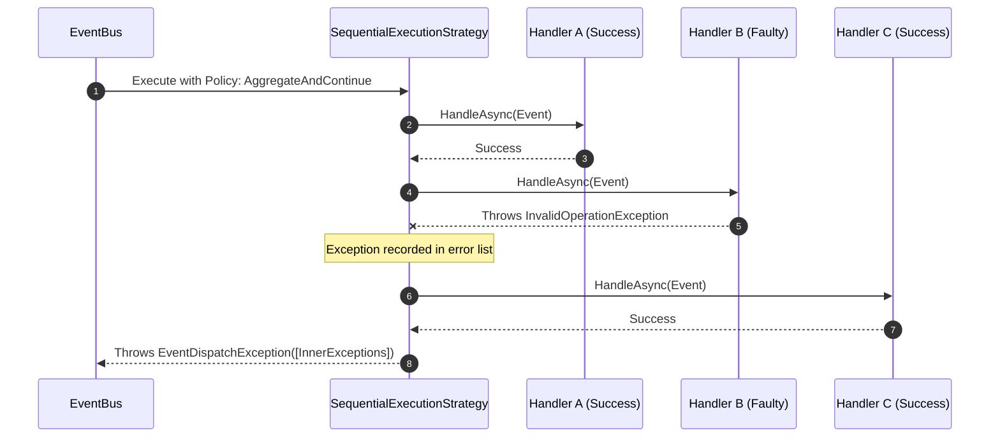

# System Architecture — EricksonLopez.Events

Technical architecture document, functional component map, responsibility boundaries, and flow diagrams for the **EricksonLopez.Events** ecosystem.

---

## 1. Architectural Design Principles

1. **AOT-First & Zero Reflection**: The dispatch and serialization core does not use runtime reflection (`MakeGenericType`, `Invoke`, `Type.GetType`), guaranteeing 100% compatibility with Native AOT and Trimming on .NET 8+.
2. **Purity of DDD Contracts**: Domain events (`IDomainEvent`) are pure, immutable data structures with no transport, serializer, or mediator dependencies.
3. **Monotonic Identity (Guid v7 on .NET 9+)**: All `EventId` values use `Guid.CreateVersion7()` (RFC 9562) on .NET 9 and later, providing temporal ordering and excellent index performance in storage. On .NET 8, `EventId.New()` falls back to `Guid.NewGuid()` (v4, non-sortable).
4. **Separation of Transport vs. In-Process Dispatch**:
   - **`EricksonLopez.Events`**: Dispatches domain and integration events **within the process**.
   - **`EricksonLopez.Messaging`**: Distributed transport to external message brokers (Kafka, RabbitMQ, Service Bus).

---

## 2. Functional Component Map

---

## 3. Flow and Sequence Diagrams (Mermaid)

### Publication Flow and Middleware Pipeline

### Error Handling Flow with `AggregateAndContinue`

---

## 4. Boundary and Responsibility Matrix

| Package | Primary Responsibility | Dependencies | AOT Support |
|---|---|---|:---:|
| `EricksonLopez.Events.Contracts` | Base contracts, identity structs (Guid v7), interfaces. | BCL only | ✅ 100% |
| `EricksonLopez.Events` | In-memory bus, middlewares, envelopes, thread-safe registry. | Contracts, Microsoft.Extensions.DI | ✅ 100% |
| `EricksonLopez.Events.Serialization.SystemTextJson` | AOT-safe JSON converters for structs and generic envelopes. | System.Text.Json | ✅ 100% |
| `EricksonLopez.Events.Generators` | Roslyn Generator for event discovery and ELE001–ELE005 analyzers. | Microsoft.CodeAnalysis | ✅ 100% |
| `EricksonLopez.Events.CloudEvents` | Bidirectional mapping to CNCF CloudEvents v1.0 specification. | Contracts, System.Text.Json | ✅ 100% |
| `EricksonLopez.Events.OpenTelemetry` | Traces and Metrics OTel instrumentation for the EventBus. | OpenTelemetry.Api | ✅ 100% |
| `EricksonLopez.Events.Inbox` | Idempotent consumer decorator and deduplication. | Contracts, EricksonLopez.Inbox | ✅ 100% |
| `EricksonLopez.Events.Outbox` | Transactional publisher persisted in Outbox. | Contracts, EricksonLopez.Outbox | ✅ 100% |
| `EricksonLopez.Events.Testing` | Test spies, builders, and fluent assertion DSL. | Events | ✅ 100% |
