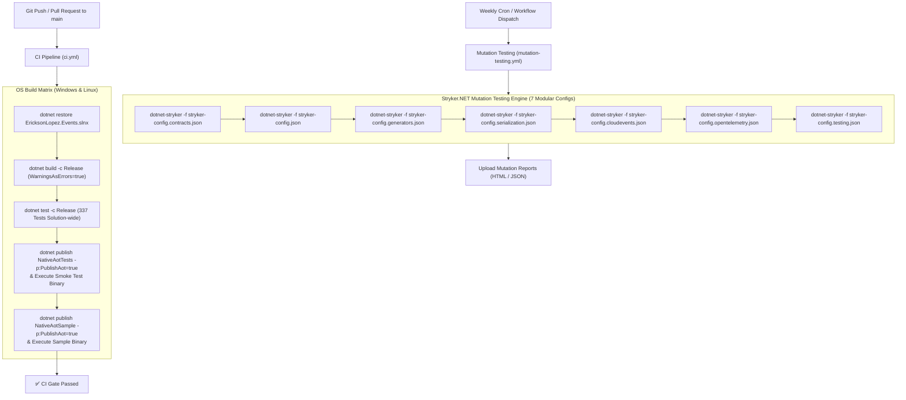

# Build, CI/CD and Quality Engineering Architecture

> **Exhaustive documentation of continuous integration pipelines, quality gates, mutation testing policies, and Native AOT verification.**

---

## 1. CI/CD Pipeline Architecture

The repository employs GitHub Actions workflows to validate code quality, compile-time Roslyn analyzers, test suites, and Native AOT binaries across multiple operating systems.



---

## 2. GitHub Actions Workflows

### 2.1 Continuous Integration: `.github/workflows/ci.yml`

* **Triggers:**
  * `push` to `main`
  * `pull_request` targeting `main`
* **Execution Environment:** Matrix Strategy (`windows-latest`, `ubuntu-latest`)
* **SDK Version:** .NET SDK `10.0.x`
* **Core Steps:**
  1. **Checkout**: `actions/checkout@v4`
  2. **SDK Setup**: `actions/setup-dotnet@v4` with `dotnet-version: '10.0.x'`
  3. **Restore**: `dotnet restore EricksonLopez.Events.slnx`
  4. **Strict Release Build**: `dotnet build EricksonLopez.Events.slnx -c Release --no-restore` (enforcing `TreatWarningsAsErrors=true`)
  5. **Solution-Wide Testing**: `dotnet test EricksonLopez.Events.slnx -c Release --no-build --verbosity normal`
  6. **Native AOT Test Suite Compilation & Execution**:
     * Windows: `dotnet publish tests/.../EricksonLopez.Events.NativeAotTests.csproj -c Release -r win-x64 -p:PublishAot=true`
     * Linux: `dotnet publish tests/.../EricksonLopez.Events.NativeAotTests.csproj -c Release -r linux-x64 -p:PublishAot=true`
  7. **Native AOT Sample App Verification**:
     * Publishes and executes `samples/NativeAotSample` with `PublishAot=true` to guarantee zero trimming warnings in end-to-end applications.

### 2.2 Mutation Testing: `.github/workflows/mutation-testing.yml`

* **Triggers:**
  * `schedule`: Weekly on Sunday at `03:00 UTC` (`0 3 * * 0`)
  * `workflow_dispatch`: Manual trigger
* **Runner:** `ubuntu-latest`
* **Core Steps:**
  1. Installs global `dotnet-stryker` tool.
  2. Executes mutation testing runs against the test suites. Additional modules (`contracts`, `testing`, `generators`, `serialization`, `cloudevents`, `opentelemetry`) can also be run locally — see [CONTRIBUTING.md](../../CONTRIBUTING.md) for the full command set.
  3. Uploads generated reports via `actions/upload-artifact@v4`.

---

## 3. Quality Gates & Enforcement Mechanisms

| Quality Gate | Tool / Mechanism | Configured Threshold | Status |
| :--- | :--- | :---: | :---: |
| **Compiler Warnings** | MSBuild `TreatWarningsAsErrors=true` | 0 Warnings | ✅ Enforced |
| **Static Code Analysis** | Roslyn `AnalysisLevel=latest-recommended` + Custom Analyzers | 0 Violations | ✅ Enforced |
| **Code Style** | `.editorconfig` + `EnforceCodeStyleInBuild=true` | 0 Violations | ✅ Enforced |
| **Unit & Integration Tests** | xUnit 2.9.3 + AwesomeAssertions 9.5.0 | 337 / 337 Passing | ✅ Enforced |
| **Architecture Boundaries** | NetArchTest.eNhancedEdition 1.4.3 | 18 / 18 Rules Passing | ✅ Enforced |
| **Mutation Testing** | Stryker.NET (7 modular configs) | `break: 95` (98.74% actual) | ✅ Enforced |
| **Native AOT & Trimming** | IL Compiler (`PublishAot=true`, `IsTrimmable=true`) | 0 Trimming Warnings | ✅ Enforced |

---

## 4. Mutation Testing Strategy (Stryker.NET)

Per [ADR-031](../adr/adr-031-stryker-mutation-testing-policy.md), mutation testing is decomposed into **7 modular configuration files** (`stryker-config.contracts.json`, `stryker-config.json`, `stryker-config.generators.json`, `stryker-config.serialization.json`, `stryker-config.cloudevents.json`, `stryker-config.opentelemetry.json`, `stryker-config.testing.json`) to ensure rapid, targeted feedback and prevent score dilution:

```json
{
  "stryker-config": {
    "reporters": [ "html", "progress", "json" ],
    "thresholds": {
      "high": 100,
      "low": 98,
      "break": 95
    },
    "mutate": [
      "!bin/**/*",
      "!obj/**/*"
    ]
  }
}
```

* **Zero Exclusion Policy**: Disabling mutants via source comments (`// Stryker disable`) is strictly prohibited on business logic.
* **Break Threshold**: A mutation score below 95% triggers an immediate non-zero exit code, failing the pipeline.

---

## 5. Roslyn Security & Architecture Analyzers

The `EricksonLopez.Events.Generators` package ships with 5 compile-time analyzers:

- **`ELE001` (Event Name Validation)**: Flags invalid or empty event names in `[EventName]`.
- **`ELE002` (Event Version Validation)**: Ensures `[EventVersion]` specifies a positive monotonic integer.
- **`ELE003` (Event Source Validation)**: Validates non-empty event source strings in `[EventSource]`.
- **`ELE004` (Event Immutability Rule)**: Enforces that types implementing `IEvent` are defined as `readonly record struct` or `sealed record`.
- **`ELE005` (Domain Event Boundary Rule)**: Prevents `IDomainEvent` implementations from leaking outside domain layers.

---

## 6. Release & Supply Chain Security Strategy

1. **Central Package Management (CPM)**: All dependency versions are centrally locked in [`Directory.Packages.props`](../../Directory.Packages.props).
2. **Reproducible Builds**: All assemblies are compiled with `EmbedUntrackedSources=true` and `PublishRepositoryUrl=true`.
3. **Symbol Packages**: Debug symbols are embedded and packaged as `.snupkg` files (`IncludeSymbols=true`).
4. **Semantic Versioning**: Strict adherence to SemVer 2.0.0.

---

## 7. Known Technical Debt

| Item | Description | Impact | Remediation |
| :--- | :--- | :---: | :--- |
| **Mutation CI Partial Coverage** | `mutation-testing.yml` runs only 5 of 9 Stryker modules. `contracts`, `inbox`, `outbox`, and `testing` modules are not automated in CI. | Medium | Add the 4 missing `dotnet-stryker` steps to `mutation-testing.yml`. |
| **No NuGet Publish Workflow** | There is no `.github/workflows/publish.yml` to automate NuGet package publishing. | Medium | Create a tag-triggered `publish.yml` with OIDC trusted publishing. |
| **No `dependabot.yml`** | Dependency updates are not automated. All package versions are pinned in `Directory.Packages.props`. | Low | Add `.github/dependabot.yml` for `nuget` ecosystem monitoring. |
