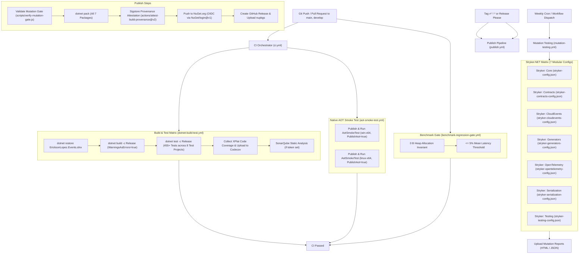

# Build, CI/CD and Quality Engineering Architecture

> **Exhaustive documentation of continuous integration pipelines, quality gates, mutation testing policies, and Native AOT verification.**

---

## 1. CI/CD Pipeline Architecture

The repository employs GitHub Actions workflows to validate code quality, compile-time Roslyn analyzers, test suites, benchmark regressions, and Native AOT binaries across multiple operating systems.



---

## 2. GitHub Actions Workflows

The repository maintains **11 distinct workflows** catering to continuous integration, regression prevention, nightly stress, performance tracking, compliance, and publishing.

### 2.1 Continuous Integration Orchestrator: `.github/workflows/ci.yml`

* **Triggers:**
  * `push` to `main`, `develop`
  * `pull_request` targeting `main`, `develop`
* **Orchestration:** Dispatches reusable matrix jobs:
  1. `.github/workflows/dotnet-build-test.yml`: Cross-platform build and test matrix on `windows-latest` and `ubuntu-latest`.
  2. `.github/workflows/aot-smoke-test.yml`: Native AOT binary compilation and execution validation.

### 2.2 Reusable Build & Test Matrix: `.github/workflows/dotnet-build-test.yml`

* **Triggers:** Reusable workflow (`workflow_call`).
* **Runners:** `windows-latest`, `ubuntu-latest`.
* **Execution Steps:**
  1. Sets up .NET SDK 10.0.x.
  2. Restores Strong Name key from `SNK_KEY` secret.
  3. Restores solution dependencies via `dotnet restore EricksonLopez.Events.slnx`.
  4. Builds in Release configuration with `TreatWarningsAsErrors=true`.
  5. Executes all 455+ unit, integration, architecture, and generator tests with XPlat code coverage collection.
  6. Uploads coverage reports to Codecov (`CODECOV_TOKEN`).
  7. Executes SonarCloud static analysis on Ubuntu runner (when `SONAR_TOKEN` is configured).

### 2.3 Native AOT Smoke Test: `.github/workflows/aot-smoke-test.yml`

* **Triggers:** Reusable workflow (`workflow_call`).
* **Runners:** `windows-latest`, `ubuntu-latest`.
* **Execution Steps:**
  1. Publishes `tests/EricksonLopez.Events.AotSmokeTest/EricksonLopez.Events.AotSmokeTest.csproj` under `-c Release -p:PublishAot=true` targeting `win-x64` and `linux-x64`.
  2. Executes compiled native binary with zero trimming warnings (`IL2026`, `IL3050`), validating full end-to-end event bus registration, dispatch, and serialization in Native AOT.

### 2.4 Benchmark Regression Gate: `.github/workflows/benchmark-regression-gate.yml`

* **Triggers:**
  * `pull_request` targeting `main`, `develop` modifying paths `src/**` or `benchmarks/**`.
  * `workflow_dispatch` with configurable regression threshold (default: 5%).
* **Runner:** `ubuntu-latest`.
* **Execution Steps:** Executes [`scripts/verify-benchmark-gate.ps1`](../../scripts/verify-benchmark-gate.ps1) to assert:
  1. **Heap Allocation Invariant**: Ensures 0 B allocated on all hot path combinators and dispatch operations.
  2. **Latency Regression Threshold**: Fails the PR if mean latency degrades by $> 5\%$ against baseline.

### 2.5 Benchmarks Baseline Capture: `.github/workflows/benchmarks.yml`

* **Triggers:**
  * `push` tags `v*`.
  * `workflow_dispatch` (with input filters and `commit-results` options).
* **Runner:** `ubuntu-latest` (with multi-version .NET 8.0.x and 10.0.x).
* **Execution Steps:** Runs BenchmarkDotNet short jobs across runtimes `net8.0` and `net10.0`, exports JSON and Markdown summaries, uploads artifacts, and commits updated performance baselines back to `benchmarks/results/`.

### 2.6 Weekly Deep Benchmarks: `.github/workflows/weekly-benchmarks.yml`

* **Triggers:**
  * `schedule`: Weekly on Sunday at `02:00 UTC` (`0 2 * * 0`).
  * `workflow_dispatch`.
* **Runner:** `ubuntu-latest` (with multi-version .NET 8.0.x, 9.0.x, and 10.0.x).
* **Execution Steps:** Executes Default Job benchmarks with extended warmups across .NET 8, 9, and 10; updates long-term performance tracking baselines.

### 2.7 Mutation Testing: `.github/workflows/mutation-testing.yml`

* **Triggers:**
  * `schedule`: Weekly on Monday at `04:00 UTC` (`0 4 * * 1`).
  * `workflow_dispatch`: Manual trigger with configurable mutation level (`Basic`, `Standard`, `Advanced`).
* **Runner:** `ubuntu-latest`.
* **Execution Strategy:** Matrix job executing Stryker.NET across all 7 packages using dedicated modular configuration files:
  - `stryker-config.json` (`EricksonLopez.Events`)
  - `stryker-contracts-config.json` (`EricksonLopez.Events.Contracts`)
  - `stryker-cloudevents-config.json` (`EricksonLopez.Events.CloudEvents`)
  - `stryker-generators-config.json` (`EricksonLopez.Events.Generators`)
  - `stryker-opentelemetry-config.json` (`EricksonLopez.Events.OpenTelemetry`)
  - `stryker-serialization-config.json` (`EricksonLopez.Events.Serialization.SystemTextJson`)
  - `stryker-testing-config.json` (`EricksonLopez.Events.Testing`)
* **Break Threshold:** Hard stop at 95% mutation score; generates and uploads standalone HTML and JSON mutation reports per package.

### 2.8 Nightly Deep Validation: `.github/workflows/nightly.yml`

* **Triggers:**
  * `schedule`: Daily at `02:00 UTC` (`0 2 * * *`).
  * `workflow_dispatch`.
* **Runners:** Matrix on `ubuntu-latest` and `windows-latest`.
* **Execution Steps:** Full clean restore, build with strict warnings-as-errors, complete test execution with XPlat coverage, package generation validation, and cross-platform Native AOT binary compilation and execution.

### 2.9 Package Publishing: `.github/workflows/publish.yml`

* **Triggers:**
  * `push` tags matching `v*.*.*`.
  * `workflow_dispatch` with optional version override.
* **Runner:** `ubuntu-latest`.
* **Security & Verification Steps:**
  1. Validates mutation testing quality gate via `scripts/verify-mutation-gate.js`.
  2. Restores Strong Name key from `SNK_KEY` secret.
  3. Executes clean Release build and full test suite with coverage.
  4. Packs all 7 ecosystem `.csproj` packages into `./artifacts`.
  5. Generates Sigstore Keyless Provenance Attestation via `actions/attest-build-provenance@v2`.
  6. Authenticates to NuGet.org using OpenID Connect (OIDC) via `NuGet/login@v1` (zero static API keys).
  7. Publishes packages using `dotnet nuget push --skip-duplicate`.
  8. Creates GitHub Release attaching `.nupkg` and `.snupkg` binaries.

### 2.10 Release Please Automation: `.github/workflows/release-please.yml`

* **Triggers:** `push` to `main`.
* **Runner:** `ubuntu-latest`.
* **Execution Steps:** Uses `googleapis/release-please-action@v4` with `.release-please-config.json` and `.release-please-manifest.json` to analyze Conventional Commits, maintain `CHANGELOG.md`, update versions, and create release PRs. When a release PR is merged, it dispatches `publish.yml` with the release version.

### 2.11 Repository Compliance Gate: `.github/workflows/repo-compliance.yml`

* **Triggers:** `push` to `main`, `pull_request` targeting `main`, `workflow_dispatch`.
* **Runner:** `ubuntu-latest`.
* **Execution Steps:** Executes [`scripts/verify-compliance.ps1`](../../scripts/verify-compliance.ps1) to audit architectural boundaries, one-type-per-file compliance, and NuGet packaging integrity.

### 2.12 Automated Dependency Updates: `.github/dependabot.yml`

* **Ecosystems & Schedule:**
  * `nuget`: Weekly on **Monday at 03:00 UTC** (limit: 10 PRs). Configured with automated groups for `microsoft-extensions`, `opentelemetry`, and `test-dependencies`.
  * `github-actions`: Weekly on **Monday at 03:00 UTC** (limit: 5 PRs).

---

## 3. Quality Gates & Enforcement Mechanisms

| Quality Gate | Tool / Mechanism | Configured Threshold | Status |
| :--- | :--- | :---: | :---: |
| **Compiler Warnings** | MSBuild `TreatWarningsAsErrors=true` | 0 Warnings | ✅ Enforced |
| **Static Code Analysis** | Roslyn `AnalysisLevel=latest-recommended` + Custom Analyzers | 0 Violations | ✅ Enforced |
| **Code Style** | `.editorconfig` + `EnforceCodeStyleInBuild=true` | 0 Violations | ✅ Enforced |
| **Unit & Integration Tests** | xUnit 2.9.3 + AwesomeAssertions 9.6.0 | 455+ Tests Passing across 8 Projects | ✅ Enforced |
| **Architecture Boundaries** | NetArchTest.eNhancedEdition 1.4.5 | All Boundary Rules Passing | ✅ Enforced |
| **Mutation Testing** | Stryker.NET (7 modular configs) | `break: 95%` (Score $\ge 98\%$) | ✅ Enforced |
| **Native AOT & Trimming** | IL Compiler (`PublishAot=true`, `IsTrimmable=true`) | 0 Trimming Warnings, Smoke Binary Passing | ✅ Enforced |
| **Benchmark Regression** | BenchmarkDotNet + Regression Gate Script | 0 B Alloc Invariant, $\le 5\%$ Latency Regr. | ✅ Enforced |
| **Supply Chain Attestation** | Sigstore / GitHub Attestations + Strong Name | Cryptographic Signatures Verified | ✅ Enforced |

---

## 4. Mutation Testing Strategy (Stryker.NET)

Per [ADR-031](../adr/adr-031-stryker-mutation-testing-policy.md), mutation testing is decomposed into **7 modular configuration files** (`stryker-config.json`, `stryker-contracts-config.json`, `stryker-cloudevents-config.json`, `stryker-generators-config.json`, `stryker-opentelemetry-config.json`, `stryker-serialization-config.json`, `stryker-testing-config.json`):

```json
{
  "stryker-config": {
    "reporters": [ "html", "progress", "json" ],
    "thresholds": {
      "high": 100,
      "low": 98,
      "break": 95
    },
    "mutate": [
      "!bin/**/*",
      "!obj/**/*"
    ]
  }
}
```

* **Zero Exclusion Policy**: Disabling mutants via source comments (`// Stryker disable`) is strictly prohibited on business logic.
* **Break Threshold**: A mutation score below 95% triggers an immediate non-zero exit code, failing the pipeline.

---

## 5. Roslyn Security & Architecture Analyzers

The `EricksonLopez.Events.Generators` package ships with 5 compile-time Roslyn analyzers:

- **`ELE001` (Event Immutability Rule)**: Enforces that types implementing `IEvent` are defined as `readonly record struct` or `sealed record` with init-only properties (Error, DDD.Design).
- **`ELE002` (Event Version Validation)**: Ensures `[EventVersion]` specifies a positive monotonic integer greater than zero (Error, DDD.Design).
- **`ELE003` (Event Name Validation)**: Flags invalid, empty, or whitespace-only event names in `[EventName]` (Warning, DDD.Design).
- **`ELE004` (Event Source Validation)**: Validates non-empty event source URI/identifier strings in `[EventSource]` (Warning, DDD.Design).
- **`ELE005` (Domain Event Boundary Rule)**: Prevents `IDomainEvent` implementations from leaking across integration event contracts or public boundaries (Warning, DDD.Architecture).

---

## 6. Release & Supply Chain Security Strategy

1. **Central Package Management (CPM)**: All dependency versions are centrally locked in [`Directory.Packages.props`](../../Directory.Packages.props).
2. **Reproducible Builds**: All assemblies are compiled with `EmbedUntrackedSources=true` and `PublishRepositoryUrl=true`.
3. **Symbol Packages**: Debug symbols are embedded and packaged as `.snupkg` files (`IncludeSymbols=true`).
4. **Strong Name Signing**: All production assemblies are strongly named with `EricksonLopez.snk`.
5. **OIDC Trusted Publishing**: NuGet packages are pushed without long-lived API tokens using short-lived OpenID Connect tokens via `NuGet/login@v1`.
6. **Provenance Attestation**: Cryptographic build provenance attestations are generated with `actions/attest-build-provenance@v2` and signed via Sigstore.

---

## 7. Known Technical Debt

| Item | Description | Impact | Remediation |
| :--- | :--- | :---: | :--- |
| **Mutation Testing CI Duration** | Full 7-module Stryker suite takes substantial execution time on standard CI runners. | Low | Retain weekly schedule and selective workflow dispatch; evaluate mutant filtering on PR diffs. |
| **Roslyn Analyzer Test Expansion** | Expand analyzer unit tests to cover rare edge cases with generic record structs and multi-target compilation. | Low | Add specialized analyzer test cases in `tests/EricksonLopez.Events.Generators.Tests`. |


