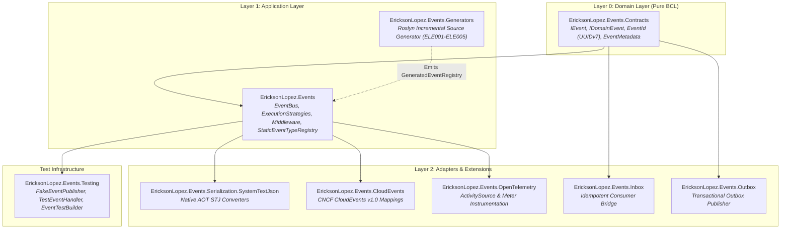
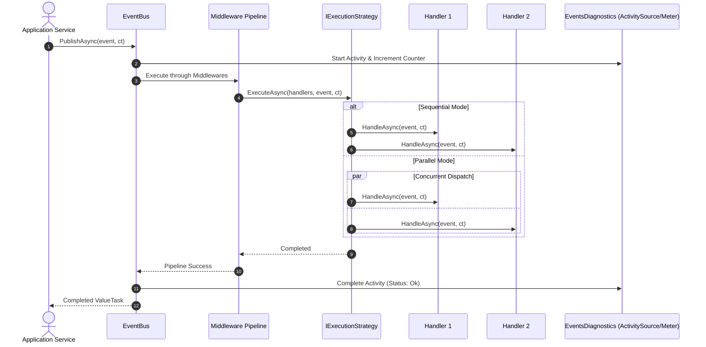
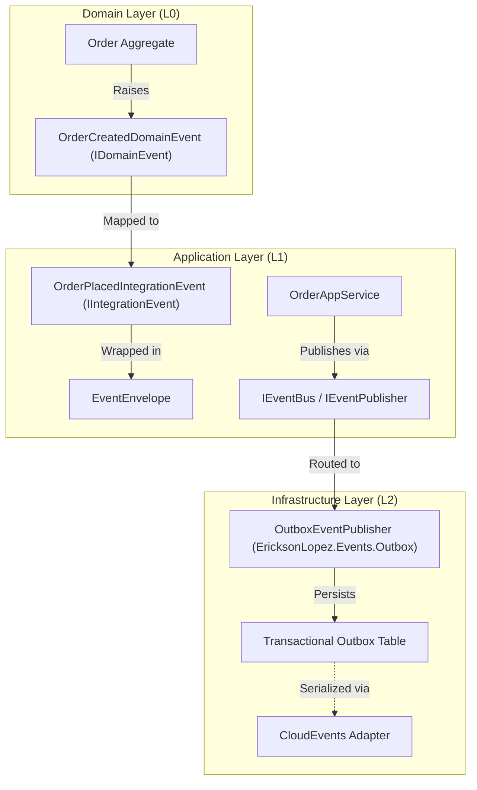
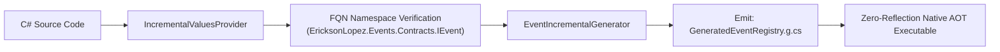

# Architecture Overview — EricksonLopez.Events

> **High-throughput, zero-reflection event contracts, in-memory bus orchestration, and ambient primitives for decoupled event-driven .NET applications, architected for trimming and Native AOT.**

---

## 1. Architectural Mission

`EricksonLopez.Events` is the foundational event modeling and dispatching ecosystem within the `EricksonLopez.*` open-source architecture. It provides pure, immutable contracts, monotonically sortable UUIDv7 identifiers, typed ambient metadata, and a zero-reflection in-memory event bus.

It solves the fundamental problem of **architectural coupling**: in traditional systems, domain models often become coupled to message broker transport SDKs (RabbitMQ, Kafka, Azure Service Bus), relational database ORMs, or reflection-heavy in-process mediator pipelines.

---

## 2. Core Architectural Tenets

1. **Native AOT & Trimming First**:
   - Zero runtime reflection in production code paths (`Assembly.GetTypes()` and `Type.MakeGenericType` are strictly eliminated).
   - Roslyn Incremental Generator (`EricksonLopez.Events.Generators`) pre-computes event descriptors and static registries at compile time.
   - Transparent Two-Path model: explicit `[RequiresUnreferencedCode]` annotations for fallback reflection paths ([ADR-021](../adr/adr-021-static-registry-aot-fallback.md)).
2. **Strict Layer Boundary Isolation**:
   - `EricksonLopez.Events.Contracts` depends strictly on the .NET BCL (0 external dependencies).
   - Core dispatchers are purely in-process; network broker mechanics are sovereignly owned by `EricksonLopez.Messaging` ([ADR-028](../adr/adr-028-events-vs-messaging-boundary.md)).
3. **Monotonic Identity & Zero Allocation**:
   - `EventId` is a 16-byte `readonly record struct` powered by native GUID Version 7 (`Guid.CreateVersion7()`).
   - High-order bits contain millisecond Unix timestamps, guaranteeing chronological sorting and eliminating B-Tree index fragmentation in databases ([ADR-003](../adr/adr-003-event-identity.md)).
   - `ISpanFormattable` and `IUtf8SpanFormattable` implementations provide zero-allocation formatting into stack-allocated memory.
4. **Domain Events vs. Integration Events**:
   - `IDomainEvent`: Expresses internal state transitions raised strictly within Aggregate Roots. Kept internal to bounded contexts.
   - `IIntegrationEvent`: Versioned, public contract decorated with `[EventName]`, `[EventVersion]`, and `[EventSource]` published to external services.
5. **Immutable Ambient Metadata**:
   - `EventMetadata` stores `CorrelationId`, `CausationId`, `TenantId`, and custom headers in a `FrozenDictionary<string, string>`, completely eliminating dynamic boxing.

---

## 3. Package Topology & Responsibilities

| Package | Layer | Responsibility | Allowed Dependencies |
| :--- | :---: | :--- | :--- |
| **`EricksonLopez.Events.Contracts`** | L0 | Pure event contracts, `EventId`, `EventType`, `EventVersion`, `EventMetadata`, `EventEnvelope<T>`. | .NET BCL only |
| **`EricksonLopez.Events`** | L1 | In-memory `EventBus`, middleware pipeline, execution strategies, error handling policies. | `Contracts`, `Microsoft.Extensions.*` |
| **`EricksonLopez.Events.Generators`** | Build | Roslyn Incremental Source Generator and analyzers (`ELE001`–`ELE005`). | `Microsoft.CodeAnalysis.CSharp` |
| **`EricksonLopez.Events.Serialization.SystemTextJson`** | L2 | Native AOT JSON converters for identifiers, metadata, and polymorphic envelopes. | `Events` |
| **`EricksonLopez.Events.CloudEvents`** | L2 | Bidirectional mapping between `EventEnvelope<T>` and CNCF `CloudEvent` v1.0. | `Events` |
| **`EricksonLopez.Events.OpenTelemetry`** | L2 | Distributed tracing and metrics instrumentation via `ActivitySource` and `Meter`. | `Events`, `OpenTelemetry` |
| **`EricksonLopez.Events.Inbox`** | L2 | Idempotent consumer decorator guaranteeing exactly-once handler execution. | `Contracts`, `EricksonLopez.Inbox.Abstractions` |
| **`EricksonLopez.Events.Outbox`** | L2 | Transactional outbox publisher bridging `IEventPublisher` to `EricksonLopez.Outbox.Abstractions`. | `Contracts`, `EricksonLopez.Outbox.Abstractions` |
| **`EricksonLopez.Events.Testing`** | Test | Public testing utilities, `FakeEventPublisher`, `TestEventHandler<T>`, `EventTestBuilder`. | `Events` |

---

## 4. In-Process EventBus & Execution Strategies

### Execution Strategy Configurations
1. **`EventExecutionMode.Sequential`**:
   - Executes handlers in deterministic order.
   - Respects `ErrorHandlingPolicy.FailFast` (immediate abort on first exception) or `ErrorHandlingPolicy.AggregateAndContinue` (captures all exceptions and throws `EventDispatchException`).
2. **`EventExecutionMode.Parallel`**:
   - Executes all handlers concurrently using `Task.WhenAll`.
   - Aggregates any encountered exceptions into `EventDispatchException`.

---

## 5. Clean Architecture Integration Flow

---

## 6. Roslyn Incremental Generator Architecture

`EricksonLopez.Events.Generators` analyzes all user-defined types implementing `IEvent`, `IDomainEvent`, or `IIntegrationEvent` at compile time:

Compile-time analyzers guarantee ecosystem rules before build completion:
- **`ELE001`**: Validates non-empty event name strings in `[EventName]`.
- **`ELE002`**: Validates monotonic version numbers in `[EventVersion]`.
- **`ELE003`**: Validates non-empty event source in `[EventSource]`.
- **`ELE004`**: Enforces immutability on event types (`readonly record struct` or `sealed record`).
- **`ELE005`**: Detects and prevents domain events (`IDomainEvent`) from leaking outside domain boundaries.
