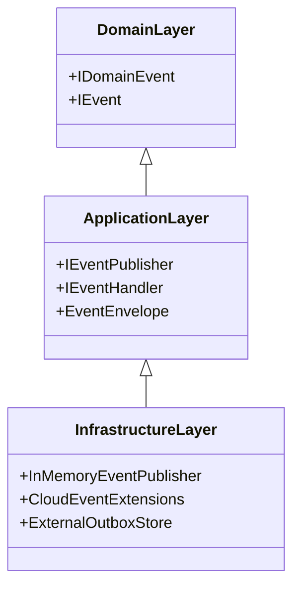

# Bounded Context & Layer Boundaries

---

## 1. Domain vs. Infrastructure Isolation

- **Domain Layer**: Cannot reference `InMemoryEventPublisher`, external Outbox stores, or CloudEvents adapters.
- **Application Layer**: Deals purely with `IEventPublisher` and `EventEnvelope<T>`.
- **Infrastructure Layer**: Bridges events to database outbox tables or distributed message brokers.

---

## 2. Architectural Boundary Specification: `EricksonLopez.Events.Contracts`

### Purpose
`EricksonLopez.Events.Contracts` provides pure, immutable domain and integration event contracts, event bus interfaces, and event metadata identifiers for decoupled, event-driven architecture.

### Owns
- Contracts: `IEvent`, `IDomainEvent`, `IIntegrationEvent`.
- Bus Interfaces: `IEventBus`, `IEventPublisher`, `IEventSubscriber`, `IEventHandler<TEvent>`, `IEnvelopeEventHandler<TEvent>`.
- Envelopes & Metadata: `IEventEnvelope<TEvent>`, `EventMetadata`, `EventMetadataBuilder`.
- Identifiers: `EventId` (RFC 9562 Guid v7), `EventType`, `EventVersion`, `CorrelationId`, `CausationId`, `TenantId`.

### Does Not Own
- In-process event bus dispatch orchestration (`EricksonLopez.Events`).
- CloudEvents serialization formatting (`EricksonLopez.Events.CloudEvents`).
- Transactional outbox storage/relay (`EricksonLopez.Outbox`).
- Idempotent inbox message consumption (`EricksonLopez.Inbox`).
- Tenancy resolution or catalog stores (`EricksonLopez.MultiTenancy`).

### Allowed Dependencies
- **.NET BCL only** (System, System.Collections.Frozen, etc.).
- **Zero** external or `EricksonLopez.*` dependencies.

### Forbidden Dependencies
- `EricksonLopez.Result`, `EricksonLopez.SharedKernel`, `EricksonLopez.Mediator`.
- Message broker client SDKs (`RabbitMQ.Client`, `Confluent.Kafka`, `Azure.Messaging.*`, `AWSSDK.*`).
- `Microsoft.Extensions.DependencyInjection` (confined to `EricksonLopez.Events`).

### Who Can Depend On It
- `EricksonLopez.Events` (Core dispatching and bus orchestration).
- `EricksonLopez.SharedKernel` (Aggregate roots raising `IDomainEvent`).
- `EricksonLopez.Messaging` (Distributed transport adapter).
- Any enterprise application domain layer or bounded context.

### Public API Rules
- All event marker interfaces and metadata records must be immutable.
- `TenantId` and `CorrelationId` represent event routing context identity only (see ADR-024).
- Identifiers are defined as `readonly record struct` to eliminate heap allocation.

### AOT & Trimming Expectations
- `<IsAotCompatible>true</IsAotCompatible>`
- `<IsTrimmable>true</IsTrimmable>`
- Zero runtime reflection in contracts.

### Provider Isolation
- 100% transport- and broker-agnostic.

### Testing Isolation
- In-memory bus fakes, spies, and event test builders live in `EricksonLopez.Events.Testing`.
