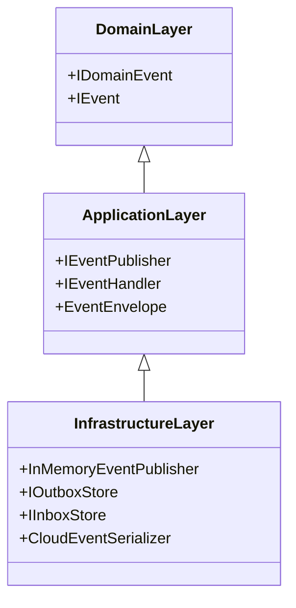

# Bounded Context & Layer Boundaries

---

## 1. Domain vs. Infrastructure Isolation

- **Domain Layer**: Cannot reference `InMemoryEventPublisher`, Outbox, or CloudEvents serializers.
- **Application Layer**: Deals purely with `IEventPublisher` and `EventEnvelope<T>`.
- **Infrastructure Layer**: Bridges events to database outbox tables or distributed message brokers.
