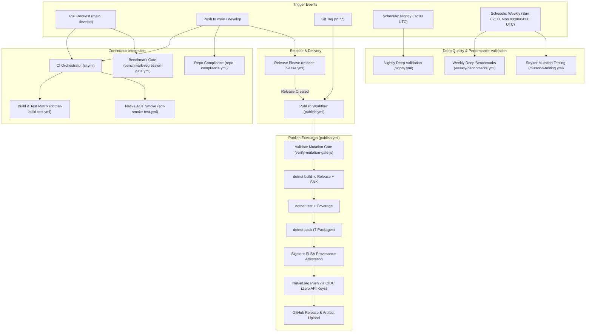

# CI/CD, Build & Quality Assurance Pipeline

This document provides comprehensive technical documentation for continuous integration, continuous delivery, automated testing, quality gates, and supply chain security in `EricksonLopez.Events`.

---

## 1. Pipeline Architecture & Workflow Topology

The CI/CD subsystem is built on GitHub Actions and coordinates 11 dedicated workflows to enforce quality gates, prevent regressions, and ensure cryptographic supply chain security:

---

## 2. GitHub Actions Workflow Inventory

| Workflow File | Name | Triggers | Runners | Key Responsibilities & Outputs |
|---|---|---|---|---|
| [`.github/workflows/ci.yml`](../.github/workflows/ci.yml) | CI Orchestrator | `push` (main, develop), `pull_request` (main, develop) | Ubuntu, Windows | Orchestrates reusable workflows `dotnet-build-test.yml` and `aot-smoke-test.yml`. |
| [`.github/workflows/dotnet-build-test.yml`](../.github/workflows/dotnet-build-test.yml) | Build & Test Matrix | `workflow_call` | `ubuntu-latest`, `windows-latest` | Strict build (`TreatWarningsAsErrors`), runs all 455+ automated tests, collects coverage, uploads to Codecov and SonarCloud. |
| [`.github/workflows/aot-smoke-test.yml`](../.github/workflows/aot-smoke-test.yml) | Native AOT Smoke Test | `workflow_call` | `ubuntu-latest`, `windows-latest` | Compiles and executes standalone native binary (`PublishAot=true`) verifying zero trimming or reflection warnings. |
| [`.github/workflows/benchmark-regression-gate.yml`](../.github/workflows/benchmark-regression-gate.yml) | Benchmark Regression Gate | `pull_request` (on `src/**`, `benchmarks/**`), `workflow_dispatch` | `ubuntu-latest` | Executes [`scripts/verify-benchmark-gate.ps1`](../scripts/verify-benchmark-gate.ps1) to enforce 0 B heap allocation and $\le 5\%$ latency degradation. |
| [`.github/workflows/benchmarks.yml`](../.github/workflows/benchmarks.yml) | Benchmarks Baseline Capture | `push` tags (`v*`), `workflow_dispatch` | `ubuntu-latest` | Runs short BenchmarkDotNet benchmarks on .NET 8 and 10, commits markdown results to `benchmarks/results/`. |
| [`.github/workflows/weekly-benchmarks.yml`](../.github/workflows/weekly-benchmarks.yml) | Weekly Deep Benchmarks | `schedule` (`0 2 * * 0` - Sun 02:00 UTC), `workflow_dispatch` | `ubuntu-latest` | Runs statistically rigorous Default Job benchmarks across .NET 8, 9, and 10; updates baseline results. |
| [`.github/workflows/mutation-testing.yml`](../.github/workflows/mutation-testing.yml) | Mutation Testing (Stryker) | `schedule` (`0 4 * * 1` - Mon 04:00 UTC), `workflow_dispatch` | `ubuntu-latest` | Matrix job running Stryker across 7 modular configuration files with a break threshold of 95%. |
| [`.github/workflows/nightly.yml`](../.github/workflows/nightly.yml) | Nightly Deep Validation | `schedule` (`0 2 * * *` - Daily 02:00 UTC), `workflow_dispatch` | `ubuntu-latest`, `windows-latest` | Deep end-to-end restore, build, test with coverage, pack, and Native AOT binary compilation and execution. |
| [`.github/workflows/publish.yml`](../.github/workflows/publish.yml) | Publish to NuGet & GitHub | `push` tags (`v*.*.*`), `workflow_dispatch` | `ubuntu-latest` | Validates mutation gate, packs 7 packages, signs via SNK, generates Sigstore SLSA attestation, pushes via OIDC. |
| [`.github/workflows/release-please.yml`](../.github/workflows/release-please.yml) | Release Please | `push` (`main`) | `ubuntu-latest` | Evaluates conventional commits, manages release PRs, generates GitHub release tags, and dispatches `publish.yml`. |
| [`.github/workflows/repo-compliance.yml`](../.github/workflows/repo-compliance.yml) | Repo Compliance & Quality Gate | `push` (`main`), `pull_request` (`main`), `workflow_dispatch` | `ubuntu-latest` | Executes [`scripts/verify-compliance.ps1`](../scripts/verify-compliance.ps1) to audit architecture rules, single-type-per-file, and package integrity. |

---

## 3. Automated Dependency Updates (Dependabot)

Configured via [`.github/dependabot.yml`](../.github/dependabot.yml):

* **Ecosystems Monitored:**
  1. `nuget`: Scans root Directory Packages and project files. Runs **weekly on Mondays at 03:00 UTC** (limit: 10 PRs).
     - Group `microsoft-extensions`: Groups `Microsoft.Extensions.*`.
     - Group `opentelemetry`: Groups `OpenTelemetry*`.
     - Group `test-dependencies`: Groups `xunit*`, `FluentAssertions*`, `coverlet.*`, `Microsoft.NET.Test.Sdk`.
  2. `github-actions`: Scans `.github/workflows/`. Runs **weekly on Mondays at 03:00 UTC** (limit: 5 PRs).

---

## 4. Secrets & Environment Configuration

| Secret Name | Consumed In | Purpose | Mandatory? |
|---|---|---|:---:|
| `SNK_KEY` | `dotnet-build-test.yml`, `publish.yml`, `benchmarks.yml`, `weekly-benchmarks.yml` | Base64-encoded Strong Name Key (`EricksonLopez.snk`) for assembly signing. | Yes (for signing) |
| `CODECOV_TOKEN` | `dotnet-build-test.yml` | Authentication token for uploading Coverlet coverage reports to Codecov. | Recommended |
| `SONAR_TOKEN` | `dotnet-build-test.yml` | Authentication token for SonarCloud static analysis. | Optional |
| `GITHUB_TOKEN` | `release-please.yml`, `publish.yml`, `benchmarks.yml` | Built-in GitHub Actions token used for commits, releases, and workflow dispatch. | Automatic |
| *None (OIDC)* | `publish.yml` | NuGet Trusted Publishing uses OpenID Connect short-lived tokens via `NuGet/login@v1`. | **Zero static keys** |

---

## 5. DevSecOps Quality Gates Matrix

| Gate | Verification Mechanism | Threshold | Action on Failure |
|---|---|---|---|
| **Gate 1: Compilation & Diagnostics** | `dotnet build -c Release` (`TreatWarningsAsErrors=true`) | 0 warnings, 0 errors, full XML doc coverage | Blocks PR |
| **Gate 2: Unit & Integration Tests** | `dotnet test -c Release` across all 8 test projects | 100% passing (455+ tests) | Blocks PR |
| **Gate 3: Code Coverage** | Coverlet XPlat Coverage + Codecov | $\ge 99\%$ project, $\ge 90\%$ patch | Blocks PR |
| **Gate 4: Static Code Analysis** | Roslyn Analyzers (`AnalysisLevel=latest-recommended`) + SonarCloud | Quality Gate A, 0 vulnerabilities | Blocks PR |
| **Gate 5: Native AOT Smoke Test** | `dotnet publish -p:PublishAot=true` + binary execution | 0 IL2026/IL3050 warnings, exit code 0 | Blocks PR |
| **Gate 6: Benchmark Regression Gate** | `verify-benchmark-gate.ps1` | 0 B heap alloc invariant, $\le 5\%$ latency regression | Blocks PR |
| **Gate 7: Stryker Mutation Testing** | Stryker.NET across 7 modular package configs | Break at 95% (target $\ge 98\%$) | Blocks Release |
| **Gate 8: Supply Chain Security** | Sigstore provenance attestation + Strong Name signing | Cryptographic signatures verified, SLSA Level 2/3 | Blocks Release |

