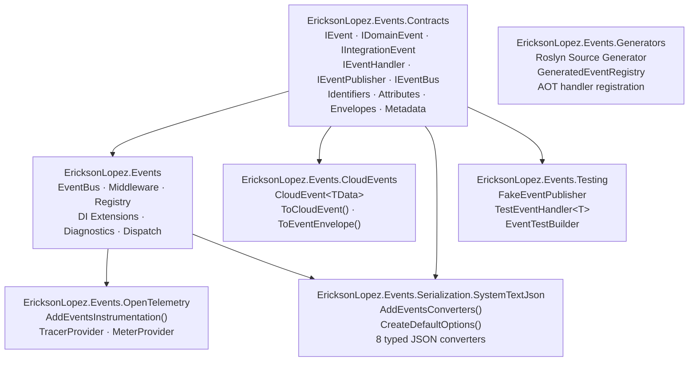
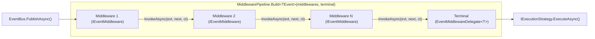
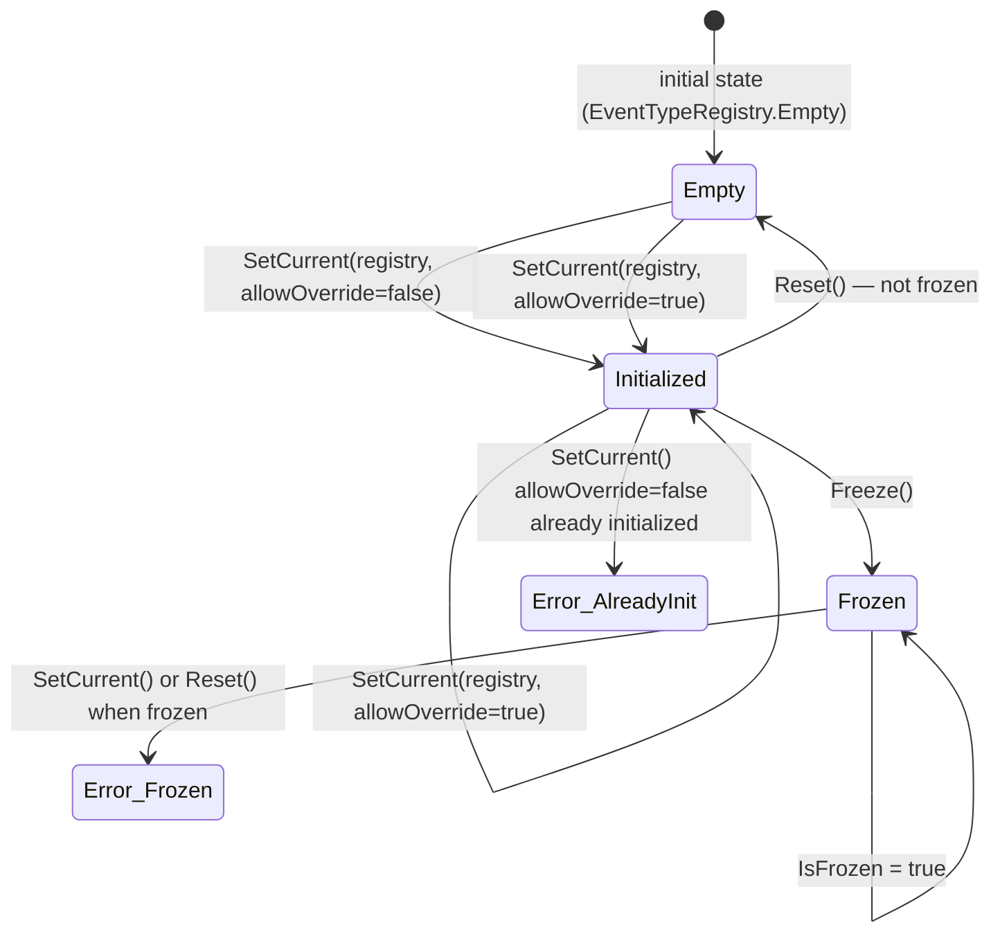
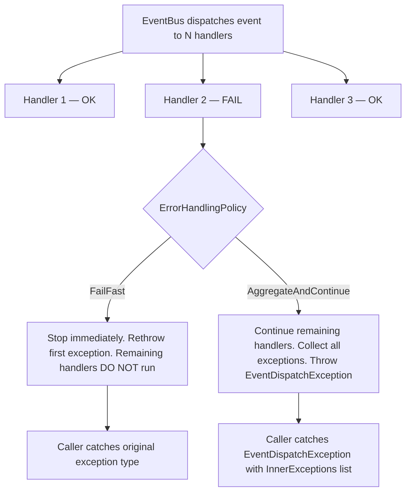
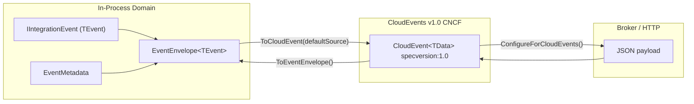

# Architecture Diagrams — EricksonLopez.Events

All diagrams are auto-generated from the public API surface as of the last Showcase synchronization.
The Showcase at `samples/ECommerce.Sample/ECommerce.App` is the **executable source of truth**.

---

## 1. Package Dependency Graph



---

## 2. End-to-End Event Dispatch Lifecycle

```mermaid
sequenceDiagram
    autonumber
    actor Caller as Application Service / Aggregate
    participant Bus as IEventBus (EventBus)
    participant Diag as EventsDiagnostics
    participant Ctx as EventContext (AsyncLocal)
    participant Pipe as MiddlewarePipeline
    participant Strat as IExecutionStrategy
    participant Scope as IServiceScope
    participant Handler as IEventHandler&lt;T&gt;

    Caller->>Bus: PublishAsync&lt;TEvent&gt;(event, ct)
    Bus->>Bus: Check MaxReentrancyDepth (AsyncLocal)
    Bus->>Diag: StartPublishActivity(event)
    activate Diag
    Bus->>Ctx: SetCurrent(envelope)
    activate Ctx
    Bus->>Diag: RecordEventPublished(eventTypeName)

    Bus->>Pipe: Build pipeline from IEventMiddleware[]
    activate Pipe
    Note over Pipe: Middleware 1 to N to Terminal

    Pipe->>Strat: ExecuteAsync(handlers, event, sp, options, ct)
    activate Strat

    alt ExecutionMode == Sequential
        loop Each Handler
            Strat->>Scope: CreateScope() if ScopePolicy != ReuseAmbientScope
            Scope->>Handler: HandleAsync(event, ct)
            Handler-->>Strat: ValueTask done
            Strat->>Diag: RecordEventHandled(name, ms, success)
        end
    else ExecutionMode == Parallel
        Note over Strat: Parallel.ForEachAsync (MaxDegreeOfParallelism)
        par Concurrent
            Strat->>Scope: CreateScope()
            Scope->>Handler: HandleAsync(event, ct)
        and
            Strat->>Scope: CreateScope()
            Scope->>Handler: HandleAsync(event, ct)
        end
        Strat->>Diag: RecordEventHandled per handler
    end

    Strat-->>Pipe: done
    deactivate Strat
    Pipe-->>Bus: done
    deactivate Pipe
    Ctx-->>Bus: restore
    deactivate Ctx
    Diag-->>Bus: stop activity
    deactivate Diag
    Bus-->>Caller: ValueTask completed
```

---

## 3. Middleware Pipeline Construction



---

## 4. StaticEventTypeRegistry State Machine



---

## 5. Error Handling Policy Decision Tree



---

## 6. EventEnvelope to CloudEvent Roundtrip


