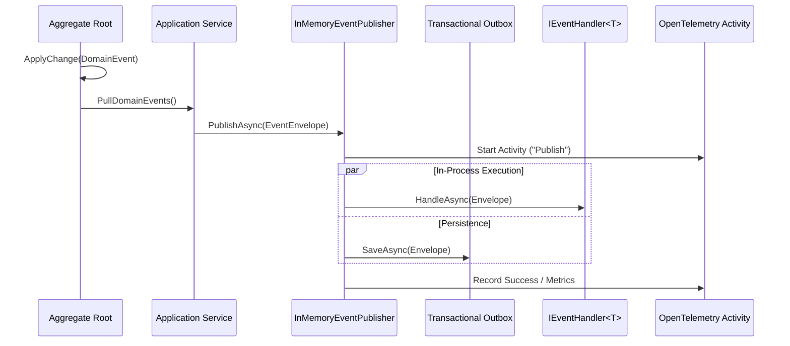

# Functional Taxonomy & Architecture Map

---

## 1. Domain Event Lifecycle

---

## 2. Layer Boundaries & Dependencies

- **Domain Layer**: References `EricksonLopez.Events.Contracts` only (`IDomainEvent`). Zero infrastructure or broker dependencies.
- **Application Layer**: Dispatches via `IEventPublisher`. Implements `IEventHandler<T>`.
- **Infrastructure Layer**: Implements `IOutboxStore`, `IInboxStore`, and bridges to external message queues (Kafka, Azure Service Bus).
- **Cross-Cutting**: `EricksonLopez.Events.OpenTelemetry` monitors distributed activity propagation.
