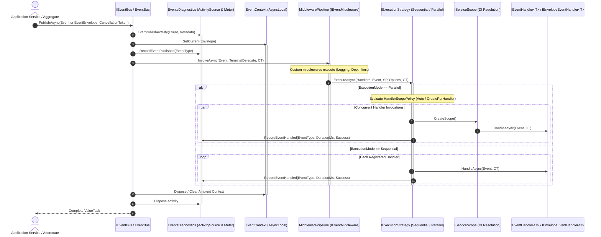

# Functional Taxonomy & Architecture Map — EricksonLopez.Events

Comprehensive functional map and lifecycle transitions detailing how all components discovered in the Public API Inventory interact from entry to exit.

---

## 1. End-to-End Event Dispatch Lifecycle

The following sequence illustrates the real architectural flow of an event through the in-process pipeline:

---

## 2. Architectural Layers & Layer Transitions

The architecture is strictly partitioned into cohesive, decoupled layers:

```mermaid
graph TD
    subgraph L1["1. Domain & Identity Layer (Pure Contracts)"]
        EventId["EventId (Monotonic GUID v7)"]
        Identifiers["EventType / EventVersion / CorrelationId / CausationId / TenantId"]
        Contracts["IEvent / IDomainEvent / IIntegrationEvent"]
    end

    subgraph L2["2. Packaging & Context Layer"]
        Metadata["EventMetadata & EventMetadataBuilder"]
        Envelope["EventEnvelope&lt;T&gt; & IEventEnvelope"]
        AmbientCtx["EventContext (Ambient AsyncLocal)"]
    end

    subgraph L3["3. Pipeline & Middleware Layer"]
        Pipeline["MiddlewarePipeline (Compile Delegate Chain)"]
        Middlewares["IEventMiddleware (e.g. CausationDepthLimitMiddleware)"]
        Diagnostics["EventsDiagnostics (W3C Tracing & Metrics)"]
    end

    subgraph L4["4. Dispatch & Registry Layer"]
        Catalog["StaticEventTypeRegistry / IEventTypeRegistry"]
        HandlerReg["IHandlerRegistry / HandlerDescriptor"]
        BusEngine["EventBus / InMemoryEventPublisher"]
    end

    subgraph L5["5. Execution & Scope Layer"]
        Strategy["IExecutionStrategy (Sequential / Parallel)"]
        ScopePolicy["HandlerScopePolicy (Auto / PerHandler / Ambient)"]
        Resilience["ErrorHandlingPolicy (FailFast / AggregateAndContinue)"]
    end

    subgraph L6["6. Consumer & Interop Layer"]
        Handlers["IEventHandler&lt;T&gt; / IEnvelopeEventHandler&lt;T&gt;"]
        CloudEvents["CloudEvent&lt;T&gt; (CNCF v1.0 Standard)"]
        NativeAOT["System.Text.Json (Zero-Reflection AOT Converters)"]
    end

    L1 --> L2
    L2 --> L3
    L3 --> L4
    L4 --> L5
    L5 --> L6
```

---

## 3. Transition Details Across Layers

### 1. Application Entry Point & Event Creation
- **Source**: Aggregate Root or Application Command Handler.
- **Action**: Constructs immutable domain or integration event with `EventId.New()` (monotonic Guid v7) and current timestamp.
- **Transition**: Passed directly to `IEventPublisher.PublishAsync(event, ct)` or wrapped via `EventEnvelope.Create(event, metadata)`.

### 2. Packaging & Ambient Context Initialization
- **Components**: `EventMetadataBuilder`, `EventMetadata`, `EventContext`.
- **Action**: Enriches the event with distributed correlation (`CorrelationId`), causal parent token (`CausationId`), and multi-tenant routing key (`TenantId`).
- **Transition**: `EventContext.SetCurrent(envelope)` sets the ambient `AsyncLocal` state, making headers accessible downstream without signature pollution.

### 3. Cross-Cutting Pipeline & Middleware Processing
- **Components**: `MiddlewarePipeline`, `IEventMiddleware`, `CausationDepthLimitMiddleware`.
- **Action**: Chains interceptors via `EventMiddlewareDelegate<T>`. Verifies causation depth does not exceed configured limits to prevent infinite recursive event loops.
- **Transition**: The terminal delegate triggers the handler resolution and execution phase.

### 4. Telemetry & Observability
- **Components**: `EventsDiagnostics`, `ActivitySource`, `Meter`.
- **Action**: Starts a W3C distributed trace activity (`messaging.system = ericksonlopez.events`) and records publish counters.

### 5. Catalog Lookup & Handler Resolution
- **Components**: `IHandlerRegistry`, `StaticEventTypeRegistry`, `HandlerDescriptor`.
- **Action**: Resolves precompiled invocation delegates (`HandlerDescriptor.Invoker`). In Native AOT mode, this eliminates reflection completely.

### 6. Execution Strategy & Scoping Boundary
- **Components**: `IExecutionStrategy`, `SequentialExecutionStrategy`, `ParallelExecutionStrategy`.
- **Action**:
  - In `Sequential` mode: Executes subscribers deterministically, reusing the ambient scope.
  - In `Parallel` mode: Executes subscribers concurrently via `Task.WhenAll`. If `ScopePolicy == HandlerScopePolicy.Auto` or `CreatePerHandler`, an isolated `IServiceScope` is created for each handler, preventing multi-threaded conflicts on scoped dependencies like EF Core `DbContext`.

### 7. Confirmation, Acknowledgment & Error Recovery
- **Components**: `ErrorHandlingPolicy`, `EventDispatchException`.
  - Under `FailFast`: First exception immediately stops execution.
  - Under `AggregateAndContinue`: Faulting handlers are isolated; sibling handlers run to completion, and all exceptions are gathered into `EventDispatchException`.
- **Metrics**: Execution duration and outcome (`success: true/false`) are recorded via `EventsDiagnostics.RecordEventHandled`.

### 8. Cleanup & Disposal
- **Action**: Ambient `EventContext` is cleared, child `IServiceScope` instances are disposed, and the calling `ValueTask` completes.
