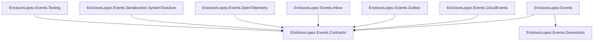

# Package Reference & Dependency Graph

---

## 1. Package Dependency Hierarchy

---

## 2. NuGet Package Inventory

| Package | Description | Dependencies |
|---|---|---|
| [`EricksonLopez.Events`](https://nuget.org/packages/EricksonLopez.Events) | In-process event bus, dispatch engine, DI extensions | `Contracts`, `Generators` |
| [`EricksonLopez.Events.Contracts`](https://nuget.org/packages/EricksonLopez.Events.Contracts) | Core event interfaces (`IDomainEvent`, `IIntegrationEvent`), `EventEnvelope<T>` | None (BCL Only) |
| [`EricksonLopez.Events.CloudEvents`](https://nuget.org/packages/EricksonLopez.Events.CloudEvents) | CNCF CloudEvents v1.0 schema conversion | `Contracts` |
| [`EricksonLopez.Events.Outbox`](https://nuget.org/packages/EricksonLopez.Events.Outbox) | Transactional Outbox persistence abstractions | `Contracts` |
| [`EricksonLopez.Events.Inbox`](https://nuget.org/packages/EricksonLopez.Events.Inbox) | Inbound idempotent Inbox abstractions | `Contracts` |
| [`EricksonLopez.Events.OpenTelemetry`](https://nuget.org/packages/EricksonLopez.Events.OpenTelemetry) | W3C Activity tracing and metrics | `Contracts` |
| [`EricksonLopez.Events.Serialization.SystemTextJson`](https://nuget.org/packages/EricksonLopez.Events.Serialization.SystemTextJson) | NativeAOT System.Text.Json converters | `Contracts` |
| [`EricksonLopez.Events.Generators`](https://nuget.org/packages/EricksonLopez.Events.Generators) | Roslyn incremental source generator | Roslyn 4.8 |
| [`EricksonLopez.Events.Testing`](https://nuget.org/packages/EricksonLopez.Events.Testing) | Test doubles and assertion extensions | `Contracts` |
