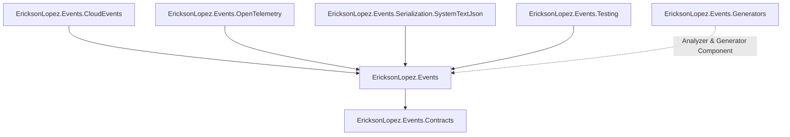

# Package Reference & Dependency Graph

---

## 1. Package Dependency Hierarchy

---

## 2. NuGet Package Inventory

| Package | Target Frameworks | Description | Direct Dependencies |
|---|---|---|---|
| [`EricksonLopez.Events`](https://nuget.org/packages/EricksonLopez.Events) | `net8.0`, `net9.0`, `net10.0` | In-process event bus, dispatch engine, pipeline middleware, DI extensions | `Contracts`, `Microsoft.Extensions.DependencyInjection.Abstractions`, `Microsoft.Extensions.Logging.Abstractions` |
| [`EricksonLopez.Events.Contracts`](https://nuget.org/packages/EricksonLopez.Events.Contracts) | `net8.0`, `net9.0`, `net10.0` | Core event interfaces (`IDomainEvent`, `IIntegrationEvent`, `IEvent`), `EventEnvelope<T>` | None (BCL Only) |
| [`EricksonLopez.Events.CloudEvents`](https://nuget.org/packages/EricksonLopez.Events.CloudEvents) | `net8.0`, `net9.0`, `net10.0` | CNCF CloudEvents v1.0 schema conversion and bidirectional mapping | `EricksonLopez.Events` |
| [`EricksonLopez.Events.OpenTelemetry`](https://nuget.org/packages/EricksonLopez.Events.OpenTelemetry) | `net8.0`, `net9.0`, `net10.0` | W3C Activity tracing and metrics instrumentation | `EricksonLopez.Events`, `OpenTelemetry` |
| [`EricksonLopez.Events.Serialization.SystemTextJson`](https://nuget.org/packages/EricksonLopez.Events.Serialization.SystemTextJson) | `net8.0`, `net9.0`, `net10.0` | Native AOT System.Text.Json converters and envelope serialization adapters | `EricksonLopez.Events` |
| [`EricksonLopez.Events.Generators`](https://nuget.org/packages/EricksonLopez.Events.Generators) | `netstandard2.0` | Roslyn incremental source generator and compile-time analyzers (`ELE001`–`ELE005`) | `Microsoft.CodeAnalysis.CSharp` (5.9.0), `Microsoft.CodeAnalysis.Analyzers` (5.9.0) |
| [`EricksonLopez.Events.Testing`](https://nuget.org/packages/EricksonLopez.Events.Testing) | `net8.0`, `net9.0`, `net10.0` | Test doubles (`FakeEventPublisher`), assertions, and testing harness | `EricksonLopez.Events` |

