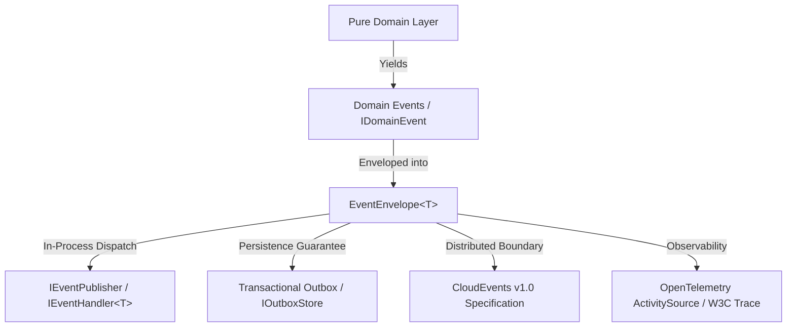

# Level 00 — Architecture & Event-Driven Philosophy

Welcome to the **EricksonLopez.Events** showcase. In this level, we explore the core philosophy behind zero-allocation, strongly-typed event architectures in modern .NET.

---

## 🎯 The Architectural Problem

In traditional event-driven enterprise systems, event delivery often suffers from:
1. **Pervasive Runtime Reflection**: Dynamic dispatchers inspecting assembly types on every event invocation, causing thread contention and blocking NativeAOT trimming.
2. **Excessive Heap Allocations**: Boxing events, allocating intermediate handler dictionaries, and heap-allocating event envelope metadata on hot publishing paths.
3. **Loss of Correlation & Observability**: Missing distributed trace propagation (W3C `traceparent`), causational tracking, and multi-tenant partitioning metadata.
4. **Boundary Violation**: Domain logic directly coupled to external message brokers (Kafka, RabbitMQ, Azure Service Bus) instead of maintaining pure in-memory domain events.

---

## 🏛️ The Solution: Tiered Event Topology

`EricksonLopez.Events` segregates event concerns into strictly bounded packages:

### Key Architectural Invariants
- **Domain Event Immutability**: Domain events are immutable `readonly record struct` or `sealed record` instances.
- **Zero Reflection**: Handlers and serializers are resolved via compile-time Roslyn Source Generators (`EricksonLopez.Events.Generators`).
- **Standardized Interoperability**: First-class CloudEvents v1.0 JSON representation for cross-service event mesh communication.
