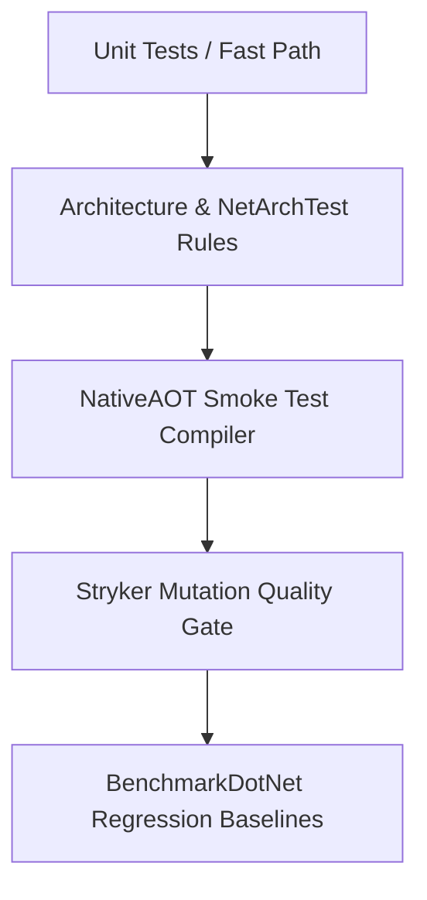

# Testing Strategy & Quality Roadmap

---

## 1. Multi-Tiered Verification Topology

### 1. Fast-Path Unit Tests
- Verifies envelope instantiation, immutability, in-process dispatching, and error handling.
- Execution time: $< 5\text{ seconds}$.

### 2. Architecture Tests
- Verifies that domain events have zero references to persistence or web abstractions.
- Enforces single-type-per-file and sealed classes across all projects.

### 3. NativeAOT Smoke Tests
- Standalone executable published via `dotnet publish -p:PublishAot=true` verifying zero runtime IL warnings.
