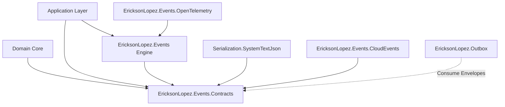

# 02. ARCHITECTURAL AUDIT & CONTEXT BOUNDARIES

## 1. DESIGN PRINCIPLES AND BOUNDED CONTEXTS
The architecture of `EricksonLopez.Events` is evaluated against Clean Architecture, Domain-Driven Design (DDD), and SOLID principles:

### Dependency Inversion Principle (DIP)
- The **`EricksonLopez.Events.Contracts`** package serves as a pure Shared Kernel for messaging. It references zero third-party packages (no Newtonsoft, no ASP.NET Core, no Microsoft DI).
- The core runtime package **`EricksonLopez.Events`** depends strictly on contracts and `Microsoft.Extensions.DependencyInjection.Abstractions`.
- No infrastructure leakage exists in domain contracts: events remain unaware of queues, brokers, or specific serialization formats.

---

## 2. SEPARATION OF CONCERNS EVALUATION

### A. Events vs Mediator (`EricksonLopez.Mediator`)
- **Mediator**: Designed for Request/Response (1-to-1), Command execution, and validation pipelines returning `Result<T>`.
- **Events**: Designed for Publish/Subscribe notifications (1-to-N). Does not return values to publishers. Publication is fire-and-forget from the perspective of the business command.
- **Verdict**: Boundaries between Mediator and Events are distinct. `Events` does not duplicate Mediator; they complement each other through handlers dispatching events after command execution.

### B. Events vs Outbox (`EricksonLopez.Outbox`)
- **Critical Boundary**: An in-memory bus (`InMemoryEventPublisher`) **MUST NOT** attempt to act as a persistent broker or distributed Outbox.
- **Leak Detected**: `TransactionalEventPublisher` buffers events in a volatile in-memory list (`_pendingEvents`). This responsibility belongs to `EricksonLopez.Outbox` where events are inserted into relational database tables within the local database transaction (`IDbTransaction`).
- **Architectural Ruling**: `TransactionalEventPublisher` should be marked obsolete and replaced by first-class integration with `EricksonLopez.Outbox`.

---

## 3. COUPLING AND COHESION
- **Temporal Coupling**: Synchronous sequential dispatch blocks the publisher until all handlers complete. This is suitable for in-process domain events where logical atomicity in the same unit of work is required, but unsuitable for cross-boundary integration events.
- **Lifecycle Coupling**: Using `HandlerScopePolicy.CreateScopePerHandler` prevents one handler from capturing or polluting instances of another handler, ensuring high cohesion and subscriber isolation.